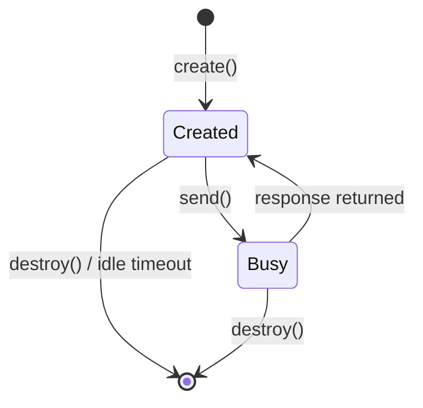
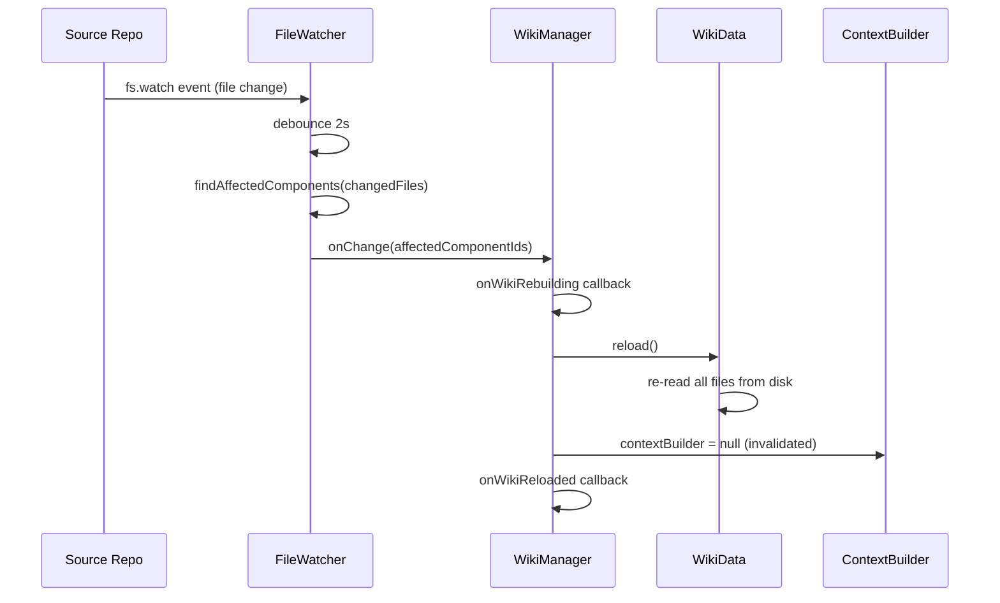

# Wiki Serving — HTTP API & runtime behavior

The routes `registerWikiRoutes` mounts, how context is retrieved for a question, how
conversation sessions and file watching behave, and how wikis are registered and
persisted. The component classes themselves are in
[wiki-serving.md](wiki-serving.md).

## HTTP API Endpoints

All endpoints are prefixed with `/api/wikis/:wikiId`.

### Ask (AI Q&A)

```
POST /api/wikis/:wikiId/ask
Content-Type: application/json
→ text/event-stream (SSE)
```

**Request body:**
```json
{
  "question": "How does authentication work?",
  "sessionId": "abc123xyz",
  "conversationHistory": [
    { "role": "user", "content": "..." },
    { "role": "assistant", "content": "..." }
  ]
}
```

**SSE event sequence:**
| Event | Payload |
|-------|---------|
| `context` | `{ componentIds, themeIds? }` — components/themes used as context |
| `chunk` | `{ content }` — streaming AI response fragment |
| `done` | `{ fullResponse, sessionId? }` |
| `error` | `{ message }` — on AI failure |

When `sessionId` is provided and the session exists in `ConversationSessionManager`, the handler operates in session mode and the AI call is routed through the session's `send()` method. Otherwise a new session is created (or legacy single-turn mode is used if `sessionManager` is `null`).

### Explore (Deep-Dive)

```
POST /api/wikis/:wikiId/explore/:componentId
Content-Type: application/json
→ text/event-stream (SSE)
```

**Request body:**
```json
{
  "question": "What design patterns does this use?",
  "depth": "deep"
}
```

Both `question` and `depth` are optional. When `question` is omitted, the handler builds a comprehensive analysis prompt based on `depth` (`normal` | `deep`). The existing component markdown from `WikiData` is injected into the prompt as prior context.

**SSE event sequence:**
| Event | Payload |
|-------|---------|
| `status` | `{ message }` — startup notification |
| `chunk` | `{ text }` — streaming fragment |
| `done` | `{ fullResponse }` |
| `error` | `{ message }` |

### Generate (Phase Regeneration)

```
POST  /api/wikis/:wikiId/admin/generate          → SSE — start phases 1-5
POST  /api/wikis/:wikiId/admin/generate/cancel   → JSON — cancel running generation
GET   /api/wikis/:wikiId/admin/generate/status   → JSON — phase cache status
POST  /api/wikis/:wikiId/admin/generate/component/:id → SSE — single-component regen
```

The generate handler dynamically imports `@plusplusoneplusplus/deep-wiki` and delegates to each phase's public API. Phase progress is streamed as SSE events. A per-wiki `Map<string, GenerationState>` prevents concurrent runs on the same wiki.

### Admin (Seeds & Config)

```
GET  /api/wikis/:wikiId/admin/seeds
PUT  /api/wikis/:wikiId/admin/seeds
GET  /api/wikis/:wikiId/admin/config
PUT  /api/wikis/:wikiId/admin/config
POST /api/wikis/:wikiId/admin/generate-seeds     → SSE
```

Seeds are stored as `seeds.yaml` alongside the source repo (or in the wiki output directory as fallback). Config is stored as `deep-wiki.config.yaml` in the repo root. The `generate-seeds` endpoint uses AI to infer theme seeds from the `ComponentGraph`.

---

## TF-IDF Context Retrieval

`ContextBuilder` implements a lightweight TF-IDF retrieval algorithm with no external dependencies (~100 lines).

**Index building (constructor):**
1. For each component, concatenate `name + purpose + category + path + keyFiles + markdown`.
2. Tokenize (lowercase, strip non-alphanumeric, remove stop words, minimum 2-char terms).
3. Compute normalized term frequencies (TF = count / total terms).
4. For theme articles, index `theme.title + theme.description + article.title + involvedComponentNames + markdown`.
5. After all documents are indexed, compute IDF = `log(N / df + 1)` for each term.

**Retrieval (`retrieve(question)`):**
1. Tokenize the question.
2. Score each document: `Σ TF(term, doc) × IDF(term)`.
3. Apply a `1.5×` boost when the component's name contains a query term.
4. Sort components and theme articles by score; select top-K of each.
5. Expand component set with 1-hop dependency neighbors if capacity remains.
6. Assemble `contextText` from selected component markdown and theme article content.
7. Return `RetrievedContext` with `componentIds`, `contextText`, `graphSummary`, and `themeContexts`.

The graph summary passed to AI includes project metadata and an abbreviated component list.

---

## Conversation Sessions

`ConversationSessionManager` implements server-side conversation state so the AI can answer follow-up questions within the same context window.



**Session lifecycle:**
- `create()` generates a 12-character random alphanumeric ID and stores session metadata.
- `send()` sets `session.busy = true` before the AI call and `false` in the `finally` block (acting as a per-session mutex).
- A `setInterval` cleanup timer (default: 1 min) removes sessions idle for more than `idleTimeoutMs` (default: 10 min).
- `destroyAll()` clears the Map and cancels the cleanup timer — called by `WikiManager.unregister()`.

**Eviction:** When `maxSessions` (default: 5) is reached, `create()` evicts the oldest non-busy session before allocating a new one. If all sessions are busy, `create()` returns `null` and the ask handler falls back to legacy single-turn mode.

---

## File Watching & Live Reload



`FileWatcher.findAffectedComponents` matches changed file paths against `ComponentInfo.path` (prefix check) and `ComponentInfo.keyFiles` (exact or suffix match). Both paths are normalized to forward slashes for cross-platform correctness.

`FileWatcher` is created only when `WikiRegistration.watch === true` and `repoPath` is set. Creation failures are caught and set `fileWatcher` to `null` without aborting the `register` call.

---

## Wiki Registration & Persistence

Wikis can be registered in three ways:

| Source | Timing | Description |
|--------|--------|-------------|
| `WikiRouteOptions.wikis` | Synchronous at server start | Explicit map of `wikiId → { wikiDir, repoPath? }` |
| `ProcessStore.getWikis()` | Async best-effort at startup | Previously persisted wikis restored from `~/.coc/` |
| `POST /api/wikis` | Runtime | Dynamic registration via REST (handled in parent api-handler) |

When restoring from `ProcessStore`, the handler skips wikis already registered from explicit options and silently ignores entries whose `component-graph.json` no longer exists on disk.

---

## Usage Examples

### Registering a wiki programmatically

```typescript
import { WikiManager } from '@plusplusoneplusplus/coc/server/wiki';

const manager = new WikiManager({
    aiSendMessage: async (prompt, opts) => {
        // delegate to CopilotSDKService
        return service.sendMessage({ prompt, ...opts });
    },
    onWikiReloaded: (wikiId, ids) => {
        console.log(`Wiki ${wikiId} reloaded; affected: ${ids.join(', ')}`);
    },
});

manager.register({
    wikiId: 'my-project',
    wikiDir: '/path/to/.wiki',
    repoPath: '/path/to/repo',
    aiEnabled: true,
    watch: true,
});
```

### Querying the context builder directly

```typescript
const contextBuilder = manager.ensureContextBuilder('my-project');
const context = contextBuilder.retrieve('How does authentication work?');
console.log(`Top components: ${context.componentIds.join(', ')}`);
console.log(context.contextText);
```

### Integrating wiki routes into a CoC server

```typescript
import { registerWikiRoutes } from '@plusplusoneplusplus/coc/server/wiki';

const routes: Route[] = [];

const wikiManager = registerWikiRoutes(routes, {
    aiEnabled: true,
    aiSendMessage: sendMessageFn,
    store: processStore,
    onWikiError: (id, err) => logger.error(`Wiki ${id} error: ${err.message}`),
});

// Pass routes to the HTTP request dispatcher
startServer({ routes, port: 4000 });
```

### Asking a question via HTTP

```bash
curl -N -X POST http://localhost:4000/api/wikis/my-project/ask \
  -H "Content-Type: application/json" \
  -d '{"question": "How does the authentication flow work?"}'
```

Streams SSE events:
```
data: {"type":"context","componentIds":["auth","session-manager"]}
data: {"type":"chunk","content":"The authentication flow begins when..."}
data: {"type":"done","fullResponse":"...","sessionId":"abc123xyz789"}
```

---
