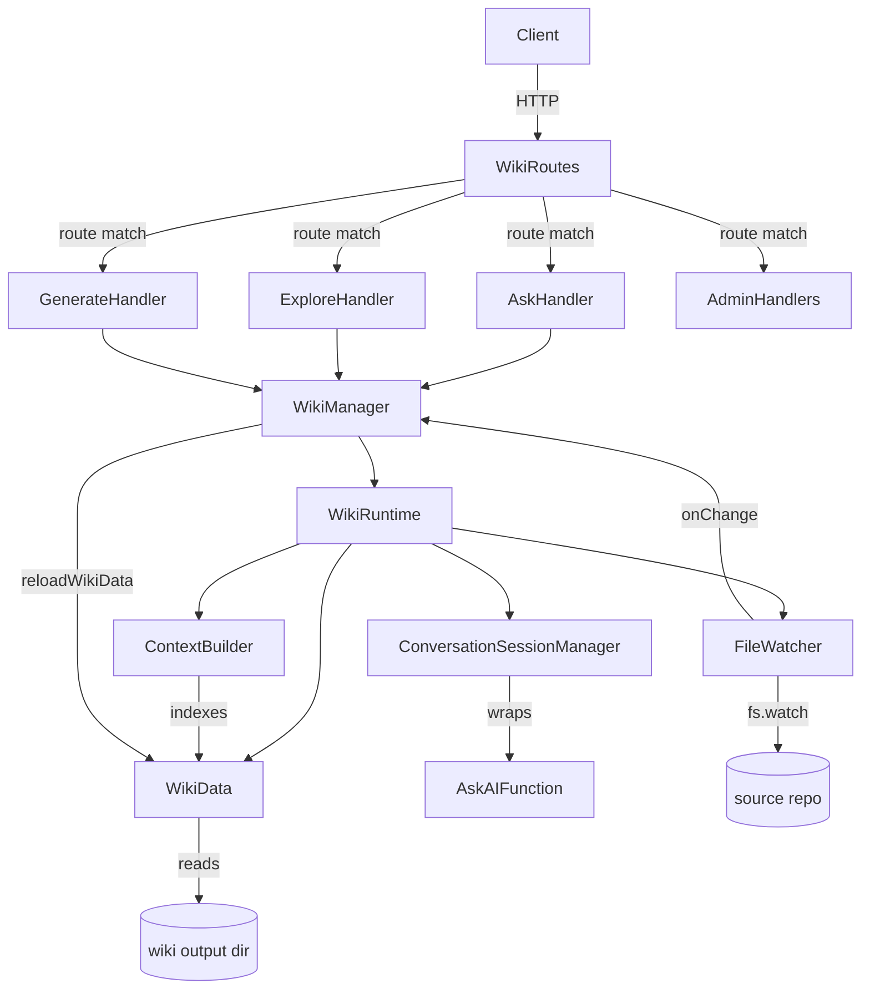
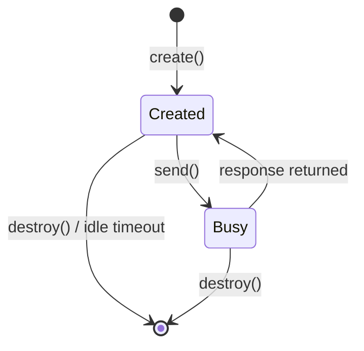
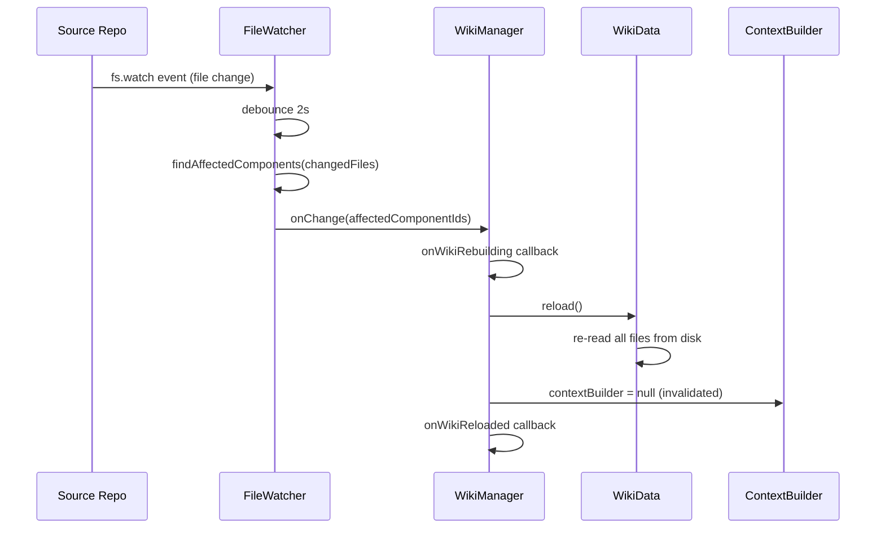

# Wiki Serving

The Wiki Serving component is a subsystem of the CoC server (`packages/coc/src/server/wiki/`) that hosts and serves auto-generated codebase documentation over HTTP. It manages a registry of wiki instances, each backed by an output directory produced by the deep-wiki generator. For every registered wiki it maintains a runtime object composed of: an in-memory data cache (`WikiData`), a lazy TF-IDF context index (`ContextBuilder`), per-user AI conversation sessions (`ConversationSessionManager`), and an optional file watcher (`FileWatcher`).

## Table of Contents

- [Purpose & Scope](#purpose--scope)
- [Architecture](#architecture)
  - [Module Map](#module-map)
  - [Runtime Object Lifecycle](#runtime-object-lifecycle)
  - [Design Patterns](#design-patterns)
- [Public API Reference](#public-api-reference)
  - [WikiManager](#wikimanager)
  - [WikiData](#wikidata)
  - [ContextBuilder](#contextbuilder)
  - [ConversationSessionManager](#conversationsessionmanager)
  - [FileWatcher](#filewatcher)
  - [registerWikiRoutes](#registerwikiroutes)
- [HTTP API Endpoints](#http-api-endpoints)
  - [Ask (AI Q&A)](#ask-ai-qa)
  - [Explore (Deep-Dive)](#explore-deep-dive)
  - [Generate (Phase Regeneration)](#generate-phase-regeneration)
  - [Admin (Seeds & Config)](#admin-seeds--config)
- [TF-IDF Context Retrieval](#tf-idf-context-retrieval)
- [Conversation Sessions](#conversation-sessions)
- [File Watching & Live Reload](#file-watching--live-reload)
- [Wiki Registration & Persistence](#wiki-registration--persistence)
- [Usage Examples](#usage-examples)
- [Dependencies](#dependencies)
- [Related Components](#related-components)
- [Sources](#sources)

---

## Purpose & Scope

The Wiki Serving component bridges the deep-wiki generator (Phase 1–5 pipeline) with end-users browsing documentation. Its responsibilities are:

1. **Wiki registry** — Maintain a `Map`-based registry of wiki instances keyed by `wikiId`; register and unregister wikis at runtime.
2. **Data layer** — Eagerly load and cache the `component-graph.json`, per-component markdown articles, `ComponentAnalysis` JSON files, and theme articles from a wiki output directory.
3. **Context indexing** — Build a TF-IDF in-memory index on first AI request, then retrieve the most relevant component articles and theme articles for any free-text question.
4. **AI Q&A** — Serve `POST /api/wikis/:wikiId/ask` streaming responses via SSE, backed by either a session-aware `ConversationSessionManager` or a single-turn legacy path.
5. **Deep-dive exploration** — Serve `POST /api/wikis/:wikiId/explore/:componentId` for on-demand per-component analysis.
6. **Live reload** — Watch the source repository with `fs.watch` (debounced) and reload wiki data when component source files change.
7. **Phase regeneration** — Delegate `POST /api/wikis/:wikiId/admin/generate` to deep-wiki's public API via dynamic import, streaming progress as SSE.
8. **Admin operations** — Provide REST endpoints for reading/writing `seeds.yaml` and `deep-wiki.config.yaml` for the admin UI.

---

## Architecture



### Module Map

| Module | Responsibility |
|--------|----------------|
| `wiki-manager.ts` | Registry + lifecycle (register/unregister/reload) |
| `wiki-data.ts` | Disk I/O — loads component graph, markdown, analyses, themes |
| `context-builder.ts` | TF-IDF index + top-K context retrieval |
| `conversation-session-manager.ts` | Multi-turn AI session pool |
| `file-watcher.ts` | `fs.watch` wrapper with debounce + component mapping |
| `wiki-routes.ts` | Route table registration; restores persisted wikis from `ProcessStore` |
| `ask-handler.ts` | `POST /ask` + SSE utilities (`sendSSE`, `readBody`, `buildAskPrompt`) |
| `explore-handler.ts` | `POST /explore/:id` + `buildExplorePrompt` |
| `generate-handler.ts` | `POST /admin/generate` — streams deep-wiki phase execution |
| `admin-handlers.ts` | `GET/PUT /admin/seeds`, `GET/PUT /admin/config`, `POST /admin/generate-seeds` |
| `types.ts` | Shared type definitions (domain types copied from deep-wiki) |
| `index.ts` | Barrel re-export |

### Runtime Object Lifecycle

```
register(WikiRegistration)
  ├─ Validate wikiDir + component-graph.json
  ├─ WikiData.load() [eager]
  ├─ ConversationSessionManager.create() [if aiEnabled]
  ├─ FileWatcher.start() [if watch + repoPath]
  └─ wikis.set(wikiId, WikiRuntime)

ensureContextBuilder(wikiId)
  └─ new ContextBuilder(graph, markdown, themeMarkdown) [lazy — first ask]

reloadWikiData(wikiId)
  ├─ WikiData.reload()
  └─ contextBuilder = null  [invalidated — rebuilt on next ask]

unregister(wikiId)
  ├─ ConversationSessionManager.destroyAll()
  ├─ FileWatcher.stop()
  └─ wikis.delete(wikiId)
```

### Design Patterns

- **Map registry** — `WikiManager.wikis: Map<string, WikiRuntime>` mirrors the `TaskWatcher` and `ProcessStore` registry patterns used elsewhere in the CoC server.
- **Lazy initialization** — `ContextBuilder` is created on the first `/ask` call and cached; invalidated on wiki reload so stale index data is never served.
- **Dynamic import** — `generate-handler.ts` imports `@plusplusoneplusplus/deep-wiki` at runtime via a `Function`-constructor trick to avoid a hard compile-time dependency.
- **SSE streaming** — All long-running operations (`ask`, `explore`, `generate`) use `sendSSE(res, data)` so the browser receives incremental updates without polling.
- **Graceful degradation** — `FileWatcher` failures at startup are silently ignored (non-fatal); `store.getWikis()` errors during restore are swallowed; generation SSE always terminates with a `done` or `error` event.

---

## Public API Reference

### WikiManager

```typescript
class WikiManager {
    constructor(options?: WikiManagerOptions)

    register(registration: WikiRegistration): void
    unregister(wikiId: string): boolean
    get(wikiId: string): WikiRuntime | undefined
    getRegisteredIds(): string[]
    ensureContextBuilder(wikiId: string): ContextBuilder
    reloadWikiData(wikiId: string): void
    disposeAll(): void
}
```

`register` validates the wiki directory, loads `WikiData` eagerly, and optionally creates a `ConversationSessionManager` and `FileWatcher`. Throws if the directory or `component-graph.json` is missing.

`ensureContextBuilder` is the only lazy call — it builds the TF-IDF index on first invocation and caches it inside `WikiRuntime`. The index is invalidated (set to `null`) whenever `reloadWikiData` runs.

### WikiData

```typescript
class WikiData {
    constructor(wikiDir: string)

    load(): void
    reload(): void

    get graph(): ComponentGraph
    getMarkdownData(): Record<string, string>
    getThemeMarkdownData(): Record<string, string>
    getComponentSummaries(): ComponentSummary[]
    getComponentDetail(id: string): ComponentDetail | undefined
    getSpecialPage(key: string): SpecialPage | undefined
    getThemeArticleDetail(themeId: string, slug: string): ThemeArticleDetail | undefined
}
```

`WikiData` reads the wiki output directory structure on `load()`:

| Loaded item | Source path |
|-------------|-------------|
| `ComponentGraph` | `component-graph.json` |
| Component markdown | `components/*.md` (flat) or `domains/*/components/*.md` (hierarchical) |
| `ComponentAnalysis` | `.analysis/<id>.json` |
| Theme articles | `themes/<themeId>/<slug>.md` |
| Special pages | `index.md`, `architecture.md`, `getting-started.md` |

### ContextBuilder

```typescript
class ContextBuilder {
    constructor(
        graph: ComponentGraph,
        markdownData: Record<string, string>,
        themeMarkdownData?: Record<string, string>,
    )

    retrieve(question: string, maxComponents?: number, maxThemes?: number): RetrievedContext
    get documentCount(): number
    get vocabularySize(): number
}

export function tokenize(text: string): string[]
```

The constructor builds the index synchronously. `retrieve` returns up to `maxComponents` (default: 5) components and `maxThemes` (default: 3) theme articles. See [TF-IDF Context Retrieval](#tf-idf-context-retrieval) for algorithm details.

### ConversationSessionManager

```typescript
class ConversationSessionManager {
    constructor(options: ConversationSessionManagerOptions)

    create(): ConversationSession | null
    get(sessionId: string): ConversationSession | undefined
    send(sessionId, prompt, options?): Promise<SessionSendResult>
    destroy(sessionId: string): boolean
    destroyAll(): void

    get size(): number
    get sessionIds(): string[]
}
```

Default limits: max 5 concurrent sessions, 10-minute idle timeout, 1-minute cleanup interval. When `maxSessions` is reached, `create()` attempts to evict the oldest idle session before returning `null`.

### FileWatcher

```typescript
class FileWatcher {
    constructor(options: FileWatcherOptions)

    start(): void
    stop(): void
    get isWatching(): boolean
}
```

Uses `fs.watch(repoPath, { recursive: true })` with a 2-second debounce. On change, maps affected filenames to component IDs using `ComponentGraph.components[*].path` and `keyFiles`, then fires `onChange(affectedComponentIds)`.

Ignores: `node_modules`, `.git`, `dist`, `build`, `out`, `*.map`, `*.lock`, `*.log`, `.DS_Store`, and other common non-source patterns.

### registerWikiRoutes

```typescript
function registerWikiRoutes(
    routes: Route[],
    options: WikiRouteOptions,
): WikiManager
```

Registers all wiki HTTP routes onto the CoC server's `Route[]` table and returns the `WikiManager` for external use. If a `ProcessStore` is provided, restores previously persisted wikis asynchronously on startup.

---

## HTTP API Endpoints

All endpoints are prefixed with `/api/wikis/:wikiId`.

### Ask (AI Q&A)

```
POST /api/wikis/:wikiId/ask
Content-Type: application/json
→ text/event-stream (SSE)
```

**Request body:**
```json
{
  "question": "How does authentication work?",
  "sessionId": "abc123xyz",
  "conversationHistory": [
    { "role": "user", "content": "..." },
    { "role": "assistant", "content": "..." }
  ]
}
```

**SSE event sequence:**
| Event | Payload |
|-------|---------|
| `context` | `{ componentIds, themeIds? }` — components/themes used as context |
| `chunk` | `{ content }` — streaming AI response fragment |
| `done` | `{ fullResponse, sessionId? }` |
| `error` | `{ message }` — on AI failure |

When `sessionId` is provided and the session exists in `ConversationSessionManager`, the handler operates in session mode and the AI call is routed through the session's `send()` method. Otherwise a new session is created (or legacy single-turn mode is used if `sessionManager` is `null`).

### Explore (Deep-Dive)

```
POST /api/wikis/:wikiId/explore/:componentId
Content-Type: application/json
→ text/event-stream (SSE)
```

**Request body:**
```json
{
  "question": "What design patterns does this use?",
  "depth": "deep"
}
```

Both `question` and `depth` are optional. When `question` is omitted, the handler builds a comprehensive analysis prompt based on `depth` (`normal` | `deep`). The existing component markdown from `WikiData` is injected into the prompt as prior context.

**SSE event sequence:**
| Event | Payload |
|-------|---------|
| `status` | `{ message }` — startup notification |
| `chunk` | `{ text }` — streaming fragment |
| `done` | `{ fullResponse }` |
| `error` | `{ message }` |

### Generate (Phase Regeneration)

```
POST  /api/wikis/:wikiId/admin/generate          → SSE — start phases 1-5
POST  /api/wikis/:wikiId/admin/generate/cancel   → JSON — cancel running generation
GET   /api/wikis/:wikiId/admin/generate/status   → JSON — phase cache status
POST  /api/wikis/:wikiId/admin/generate/component/:id → SSE — single-component regen
```

The generate handler dynamically imports `@plusplusoneplusplus/deep-wiki` and delegates to each phase's public API. Phase progress is streamed as SSE events. A per-wiki `Map<string, GenerationState>` prevents concurrent runs on the same wiki.

### Admin (Seeds & Config)

```
GET  /api/wikis/:wikiId/admin/seeds
PUT  /api/wikis/:wikiId/admin/seeds
GET  /api/wikis/:wikiId/admin/config
PUT  /api/wikis/:wikiId/admin/config
POST /api/wikis/:wikiId/admin/generate-seeds     → SSE
```

Seeds are stored as `seeds.yaml` alongside the source repo (or in the wiki output directory as fallback). Config is stored as `deep-wiki.config.yaml` in the repo root. The `generate-seeds` endpoint uses AI to infer theme seeds from the `ComponentGraph`.

---

## TF-IDF Context Retrieval

`ContextBuilder` implements a lightweight TF-IDF retrieval algorithm with no external dependencies (~100 lines).

**Index building (constructor):**
1. For each component, concatenate `name + purpose + category + path + keyFiles + markdown`.
2. Tokenize (lowercase, strip non-alphanumeric, remove stop words, minimum 2-char terms).
3. Compute normalized term frequencies (TF = count / total terms).
4. For theme articles, index `theme.title + theme.description + article.title + involvedComponentNames + markdown`.
5. After all documents are indexed, compute IDF = `log(N / df + 1)` for each term.

**Retrieval (`retrieve(question)`):**
1. Tokenize the question.
2. Score each document: `Σ TF(term, doc) × IDF(term)`.
3. Apply a `1.5×` boost when the component's name contains a query term.
4. Sort components and theme articles by score; select top-K of each.
5. Expand component set with 1-hop dependency neighbors if capacity remains.
6. Assemble `contextText` from selected component markdown and theme article content.
7. Return `RetrievedContext` with `componentIds`, `contextText`, `graphSummary`, and `themeContexts`.

The graph summary passed to AI includes project metadata and an abbreviated component list.

---

## Conversation Sessions

`ConversationSessionManager` implements server-side conversation state so the AI can answer follow-up questions within the same context window.



**Session lifecycle:**
- `create()` generates a 12-character random alphanumeric ID and stores session metadata.
- `send()` sets `session.busy = true` before the AI call and `false` in the `finally` block (acting as a per-session mutex).
- A `setInterval` cleanup timer (default: 1 min) removes sessions idle for more than `idleTimeoutMs` (default: 10 min).
- `destroyAll()` clears the Map and cancels the cleanup timer — called by `WikiManager.unregister()`.

**Eviction:** When `maxSessions` (default: 5) is reached, `create()` evicts the oldest non-busy session before allocating a new one. If all sessions are busy, `create()` returns `null` and the ask handler falls back to legacy single-turn mode.

---

## File Watching & Live Reload



`FileWatcher.findAffectedComponents` matches changed file paths against `ComponentInfo.path` (prefix check) and `ComponentInfo.keyFiles` (exact or suffix match). Both paths are normalized to forward slashes for cross-platform correctness.

`FileWatcher` is created only when `WikiRegistration.watch === true` and `repoPath` is set. Creation failures are caught and set `fileWatcher` to `null` without aborting the `register` call.

---

## Wiki Registration & Persistence

Wikis can be registered in three ways:

| Source | Timing | Description |
|--------|--------|-------------|
| `WikiRouteOptions.wikis` | Synchronous at server start | Explicit map of `wikiId → { wikiDir, repoPath? }` |
| `ProcessStore.getWikis()` | Async best-effort at startup | Previously persisted wikis restored from `~/.coc/` |
| `POST /api/wikis` | Runtime | Dynamic registration via REST (handled in parent api-handler) |

When restoring from `ProcessStore`, the handler skips wikis already registered from explicit options and silently ignores entries whose `component-graph.json` no longer exists on disk.

---

## Usage Examples

### Registering a wiki programmatically

```typescript
import { WikiManager } from '@plusplusoneplusplus/coc/server/wiki';

const manager = new WikiManager({
    aiSendMessage: async (prompt, opts) => {
        // delegate to CopilotSDKService
        return service.sendMessage({ prompt, ...opts });
    },
    onWikiReloaded: (wikiId, ids) => {
        console.log(`Wiki ${wikiId} reloaded; affected: ${ids.join(', ')}`);
    },
});

manager.register({
    wikiId: 'my-project',
    wikiDir: '/path/to/.wiki',
    repoPath: '/path/to/repo',
    aiEnabled: true,
    watch: true,
});
```

### Querying the context builder directly

```typescript
const contextBuilder = manager.ensureContextBuilder('my-project');
const context = contextBuilder.retrieve('How does authentication work?');
console.log(`Top components: ${context.componentIds.join(', ')}`);
console.log(context.contextText);
```

### Integrating wiki routes into a CoC server

```typescript
import { registerWikiRoutes } from '@plusplusoneplusplus/coc/server/wiki';

const routes: Route[] = [];

const wikiManager = registerWikiRoutes(routes, {
    aiEnabled: true,
    aiSendMessage: sendMessageFn,
    store: processStore,
    onWikiError: (id, err) => logger.error(`Wiki ${id} error: ${err.message}`),
});

// Pass routes to the HTTP request dispatcher
startServer({ routes, port: 4000 });
```

### Asking a question via HTTP

```bash
curl -N -X POST http://localhost:4000/api/wikis/my-project/ask \
  -H "Content-Type: application/json" \
  -d '{"question": "How does the authentication flow work?"}'
```

Streams SSE events:
```
data: {"type":"context","componentIds":["auth","session-manager"]}
data: {"type":"chunk","content":"The authentication flow begins when..."}
data: {"type":"done","fullResponse":"...","sessionId":"abc123xyz789"}
```

---

## Dependencies

### Internal

| Module | Usage |
|--------|-------|
| `@plusplusoneplusplus/pipeline-core` | `ProcessStore`, `WikiInfo` — persistence interface |
| `@plusplusoneplusplus/coc-server` | `Route`, `WikiServerOptions`, `sendJson`, `send400`, `send404`, `send500`, `readJsonBody` |
| `@plusplusoneplusplus/deep-wiki` | Dynamically imported by `generate-handler` for phase execution |

### External

| Package | Usage |
|---------|-------|
| `fs` (Node built-in) | Directory reads, `fs.watch`, file existence checks |
| `path` (Node built-in) | Cross-platform path construction |
| `os` (Node built-in) | `os.homedir()` for data directory defaults |
| `js-yaml` | YAML parsing in admin-handlers (dynamic import) |

---

## Related Components

- [Deep Wiki Generation](./writing.md) — Phases 1–5 that produce the `wiki/` output directory consumed by this component.
- [Codebase Discovery Engine](./codebase-discovery-engine.md) — Phase 1; produces the `component-graph.json` that `WikiData` reads eagerly.
- [Incremental Cache Invalidation](./incremental-cache-invalidation.md) — The `generate-handler` triggers deep-wiki phases with `--use-cache`, relying on git-hash-based cache to skip unchanged components.
- [AI Execution Dashboard](./map-reduce-ai-framework.md) — The CoC server that hosts these routes also serves the process-tracking SPA; `ProcessStore` is shared between the two subsystems.

---

## Sources

- `packages/coc/src/server/wiki/types.ts`
- `packages/coc/src/server/wiki/wiki-data.ts`
- `packages/coc/src/server/wiki/context-builder.ts`
- `packages/coc/src/server/wiki/conversation-session-manager.ts`
- `packages/coc/src/server/wiki/file-watcher.ts`
- `packages/coc/src/server/wiki/wiki-manager.ts`
- `packages/coc/src/server/wiki/wiki-routes.ts`
- `packages/coc/src/server/wiki/ask-handler.ts`
- `packages/coc/src/server/wiki/explore-handler.ts`
- `packages/coc/src/server/wiki/generate-handler.ts`
- `packages/coc/src/server/wiki/admin-handlers.ts`
- `packages/coc/src/server/wiki/index.ts`
