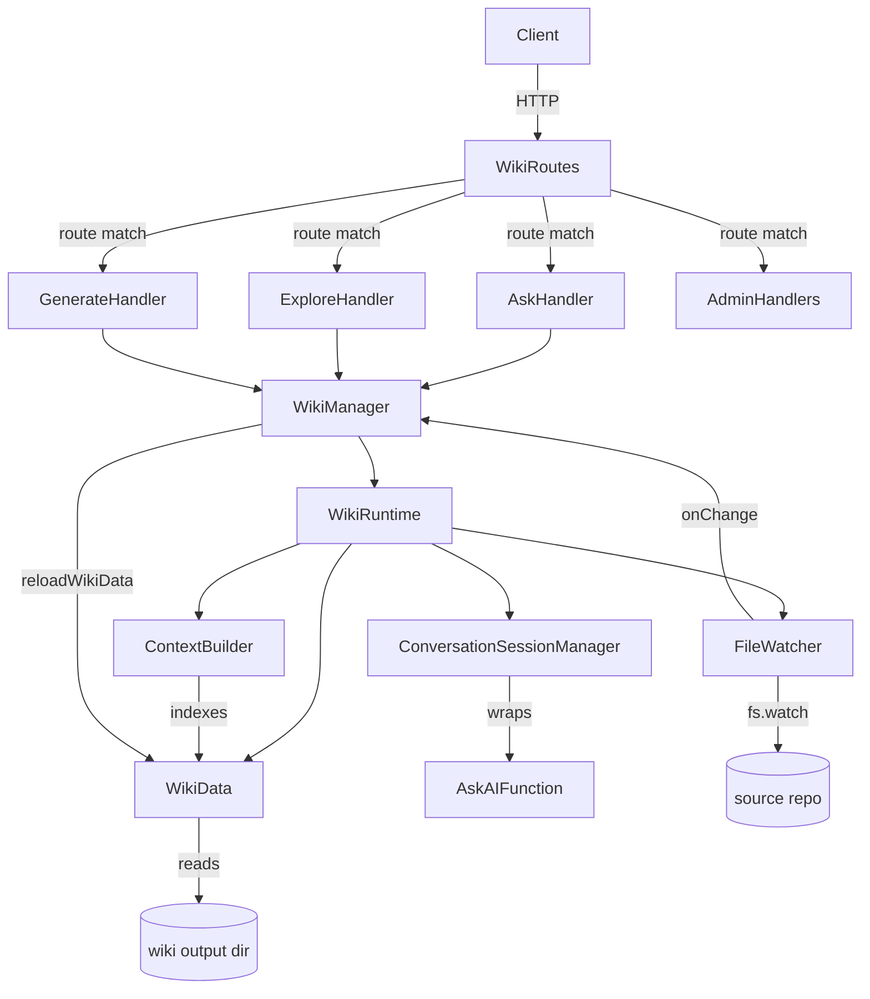

# Wiki Serving

The Wiki Serving component is a subsystem of the CoC server (`packages/coc/src/server/wiki/`) that hosts and serves auto-generated codebase documentation over HTTP. It manages a registry of wiki instances, each backed by an output directory produced by the deep-wiki generator. For every registered wiki it maintains a runtime object composed of: an in-memory data cache (`WikiData`), a lazy TF-IDF context index (`ContextBuilder`), per-user AI conversation sessions (`ConversationSessionManager`), and an optional file watcher (`FileWatcher`).

## Purpose & Scope

The Wiki Serving component bridges the deep-wiki generator (Phase 1–5 pipeline) with end-users browsing documentation. Its responsibilities are:

1. **Wiki registry** — Maintain a `Map`-based registry of wiki instances keyed by `wikiId`; register and unregister wikis at runtime.
2. **Data layer** — Eagerly load and cache the `component-graph.json`, per-component markdown articles, `ComponentAnalysis` JSON files, and theme articles from a wiki output directory.
3. **Context indexing** — Build a TF-IDF in-memory index on first AI request, then retrieve the most relevant component articles and theme articles for any free-text question.
4. **AI Q&A** — Serve `POST /api/wikis/:wikiId/ask` streaming responses via SSE, backed by either a session-aware `ConversationSessionManager` or a single-turn legacy path.
5. **Deep-dive exploration** — Serve `POST /api/wikis/:wikiId/explore/:componentId` for on-demand per-component analysis.
6. **Live reload** — Watch the source repository with `fs.watch` (debounced) and reload wiki data when component source files change.
7. **Phase regeneration** — Delegate `POST /api/wikis/:wikiId/admin/generate` to deep-wiki's public API via dynamic import, streaming progress as SSE.
8. **Admin operations** — Provide REST endpoints for reading/writing `seeds.yaml` and `deep-wiki.config.yaml` for the admin UI.

---

## Architecture


```mermaid
flowchart TD
    Client -->|HTTP| WikiRoutes
    WikiRoutes -->|route match| AskHandler
    WikiRoutes -->|route match| ExploreHandler
    WikiRoutes -->|route match| GenerateHandler
    WikiRoutes -->|route match| AdminHandlers

    AskHandler --> WikiManager
    ExploreHandler --> WikiManager
    GenerateHandler --> WikiManager

    WikiManager --> WikiRuntime
    WikiRuntime --> WikiData
    WikiRuntime --> ContextBuilder
    WikiRuntime --> ConversationSessionManager
    WikiRuntime --> FileWatcher

    WikiData -->|reads| DiskFiles[(wiki output dir)]
    ContextBuilder -->|indexes| WikiData
    ConversationSessionManager -->|wraps| AskAIFunction
    FileWatcher -->|fs.watch| RepoDir[(source repo)]
    FileWatcher -->|onChange| WikiManager
    WikiManager -->|reloadWikiData| WikiData
```

### Module Map

| Module | Responsibility |
|--------|----------------|
| `wiki-manager.ts` | Registry + lifecycle (register/unregister/reload) |
| `wiki-data.ts` | Disk I/O — loads component graph, markdown, analyses, themes |
| `context-builder.ts` | TF-IDF index + top-K context retrieval |
| `conversation-session-manager.ts` | Multi-turn AI session pool |
| `file-watcher.ts` | `fs.watch` wrapper with debounce + component mapping |
| `wiki-routes.ts` | Route table registration; restores persisted wikis from `ProcessStore` |
| `ask-handler.ts` | `POST /ask` + SSE utilities (`sendSSE`, `readBody`, `buildAskPrompt`) |
| `explore-handler.ts` | `POST /explore/:id` + `buildExplorePrompt` |
| `generate-handler.ts` | Thin HTTP/SSE adapters for `/admin/generate*` — validation, registry claim, event→SSE piping |
| `generation/generation-registry.ts` | `WikiGenerationRegistry` — per-wiki state, cancellation tokens, `reset`/`dispose` |
| `generation/deep-wiki-adapter.ts` | The only module that dynamically imports deep-wiki internals |
| `generation/generation-runner.ts` | `runWikiGeneration` — five-phase state machine emitting typed events |
| `generation/component-regeneration-runner.ts` | `runComponentRegeneration` — single-article path sharing registry/adapter/reload |
| `generation/cache-status-service.ts` | `WikiCacheStatusService` — phase cache status + metadata counts |
| `generation/events.ts` | Typed generation events + SSE / recording sinks |
| `admin-handlers.ts` | `GET/PUT /admin/seeds`, `GET/PUT /admin/config`, `POST /admin/generate-seeds` |
| `types.ts` | Shared type definitions (domain types copied from deep-wiki) |
| `index.ts` | Barrel re-export |

### Runtime Object Lifecycle

```
register(WikiRegistration)
  ├─ Validate wikiDir + component-graph.json
  ├─ WikiData.load() [eager]
  ├─ ConversationSessionManager.create() [if aiEnabled]
  ├─ FileWatcher.start() [if watch + repoPath]
  └─ wikis.set(wikiId, WikiRuntime)

ensureContextBuilder(wikiId)
  └─ new ContextBuilder(graph, markdown, themeMarkdown) [lazy — first ask]

reloadWikiData(wikiId)
  ├─ WikiData.reload()
  └─ contextBuilder = null  [invalidated — rebuilt on next ask]

unregister(wikiId)
  ├─ ConversationSessionManager.destroyAll()
  ├─ FileWatcher.stop()
  └─ wikis.delete(wikiId)
```

### Design Patterns

- **Map registry** — `WikiManager.wikis: Map<string, WikiRuntime>` mirrors the `TaskWatcher` and `ProcessStore` registry patterns used elsewhere in the CoC server.
- **Lazy initialization** — `ContextBuilder` is created on the first `/ask` call and cached; invalidated on wiki reload so stale index data is never served.
- **Dynamic import behind one adapter** — `generation/deep-wiki-adapter.ts` is the only place `@plusplusoneplusplus/deep-wiki/dist/*` is imported, at runtime, to avoid a hard compile-time dependency. Runners take a `DeepWikiAdapter` so tests substitute a fake instead of mocking module paths.
- **Injected generation registry** — `registerWikiRoutes` creates its own `WikiGenerationRegistry` (override via `options.generationRegistry`), so generation state and cancellation flags are never shared between servers or tests.
- **Events, not response writes** — runners emit typed `GenerationEvent`s; `createSseEventSink(res)` maps them onto the wire format (undefined fields omitted). Non-HTTP callers use `createRecordingEventSink`.
- **SSE streaming** — All long-running operations (`ask`, `explore`, `generate`) use `sendSSE(res, data)` so the browser receives incremental updates without polling.
- **Graceful degradation** — `FileWatcher` failures at startup are silently ignored (non-fatal); `store.getWikis()` errors during restore are swallowed; generation SSE always terminates with a `done` or `error` event.

---

## Public API Reference

### WikiManager

```typescript
class WikiManager {
    constructor(options?: WikiManagerOptions)

    register(registration: WikiRegistration): void
    unregister(wikiId: string): boolean
    get(wikiId: string): WikiRuntime | undefined
    getRegisteredIds(): string[]
    ensureContextBuilder(wikiId: string): ContextBuilder
    reloadWikiData(wikiId: string): void
    disposeAll(): void
}
```

`register` validates the wiki directory, loads `WikiData` eagerly, and optionally creates a `ConversationSessionManager` and `FileWatcher`. Throws if the directory or `component-graph.json` is missing.

`ensureContextBuilder` is the only lazy call — it builds the TF-IDF index on first invocation and caches it inside `WikiRuntime`. The index is invalidated (set to `null`) whenever `reloadWikiData` runs.

### WikiData

```typescript
class WikiData {
    constructor(wikiDir: string)

    load(): void
    reload(): void

    get graph(): ComponentGraph
    getMarkdownData(): Record<string, string>
    getThemeMarkdownData(): Record<string, string>
    getComponentSummaries(): ComponentSummary[]
    getComponentDetail(id: string): ComponentDetail | undefined
    getSpecialPage(key: string): SpecialPage | undefined
    getThemeArticleDetail(themeId: string, slug: string): ThemeArticleDetail | undefined
}
```

`WikiData` reads the wiki output directory structure on `load()`:

| Loaded item | Source path |
|-------------|-------------|
| `ComponentGraph` | `component-graph.json` |
| Component markdown | `components/*.md` (flat) or `domains/*/components/*.md` (hierarchical) |
| `ComponentAnalysis` | `.analysis/<id>.json` |
| Theme articles | `themes/<themeId>/<slug>.md` |
| Special pages | `index.md`, `architecture.md`, `getting-started.md` |

### ContextBuilder

```typescript
class ContextBuilder {
    constructor(
        graph: ComponentGraph,
        markdownData: Record<string, string>,
        themeMarkdownData?: Record<string, string>,
    )

    retrieve(question: string, maxComponents?: number, maxThemes?: number): RetrievedContext
    get documentCount(): number
    get vocabularySize(): number
}

export function tokenize(text: string): string[]
```

The constructor builds the index synchronously. `retrieve` returns up to `maxComponents` (default: 5) components and `maxThemes` (default: 3) theme articles. See [TF-IDF Context Retrieval](#tf-idf-context-retrieval) for algorithm details.

### ConversationSessionManager

```typescript
class ConversationSessionManager {
    constructor(options: ConversationSessionManagerOptions)

    create(): ConversationSession | null
    get(sessionId: string): ConversationSession | undefined
    send(sessionId, prompt, options?): Promise<SessionSendResult>
    destroy(sessionId: string): boolean
    destroyAll(): void

    get size(): number
    get sessionIds(): string[]
}
```

Default limits: max 5 concurrent sessions, 10-minute idle timeout, 1-minute cleanup interval. When `maxSessions` is reached, `create()` attempts to evict the oldest idle session before returning `null`.

### FileWatcher

```typescript
class FileWatcher {
    constructor(options: FileWatcherOptions)

    start(): void
    stop(): void
    get isWatching(): boolean
}
```

Uses `fs.watch(repoPath, { recursive: true })` with a 2-second debounce. On change, maps affected filenames to component IDs using `ComponentGraph.components[*].path` and `keyFiles`, then fires `onChange(affectedComponentIds)`.

Ignores: `node_modules`, `.git`, `dist`, `build`, `out`, `*.map`, `*.lock`, `*.log`, `.DS_Store`, and other common non-source patterns.

### registerWikiRoutes

```typescript
function registerWikiRoutes(
    routes: Route[],
    options: WikiRouteOptions,
): WikiManager
```

Registers all wiki HTTP routes onto the CoC server's `Route[]` table and returns the `WikiManager` for external use. If a `ProcessStore` is provided, restores persisted wikis asynchronously on startup.

---

## Serving surface

The HTTP routes, TF-IDF retrieval, conversation sessions, file watching, registration,
and usage examples are in [wiki-serving-api.md](wiki-serving-api.md).

## Dependencies

### Internal

| Module | Usage |
|--------|-------|
| `@plusplusoneplusplus/pipeline-core` | `ProcessStore`, `WikiInfo` — persistence interface |
| `@plusplusoneplusplus/coc-server` | `Route`, `WikiServerOptions`, `sendJson`, `send400`, `send404`, `send500`, `readJsonBody` |
| `@plusplusoneplusplus/deep-wiki` | Dynamically imported by `generate-handler` for phase execution |

### External

| Package | Usage |
|---------|-------|
| `fs` (Node built-in) | Directory reads, `fs.watch`, file existence checks |
| `path` (Node built-in) | Cross-platform path construction |
| `os` (Node built-in) | `os.homedir()` for data directory defaults |
| `js-yaml` | YAML parsing in admin-handlers (dynamic import) |

---

## Related Components

- [deep-wiki.md](deep-wiki.md) — the six-phase generation pipeline that produces the
  `wiki/` output directory this component serves, including the codebase-discovery
  phase that writes the `component-graph.json` `WikiData` reads eagerly, and the
  git-hash cache the `generate-handler` relies on when it runs phases with
  `--use-cache`.
- [server-architecture.md](server-architecture.md) — the CoC server that hosts these
  routes also serves the process-tracking SPA; `ProcessStore` is shared between them.

---
