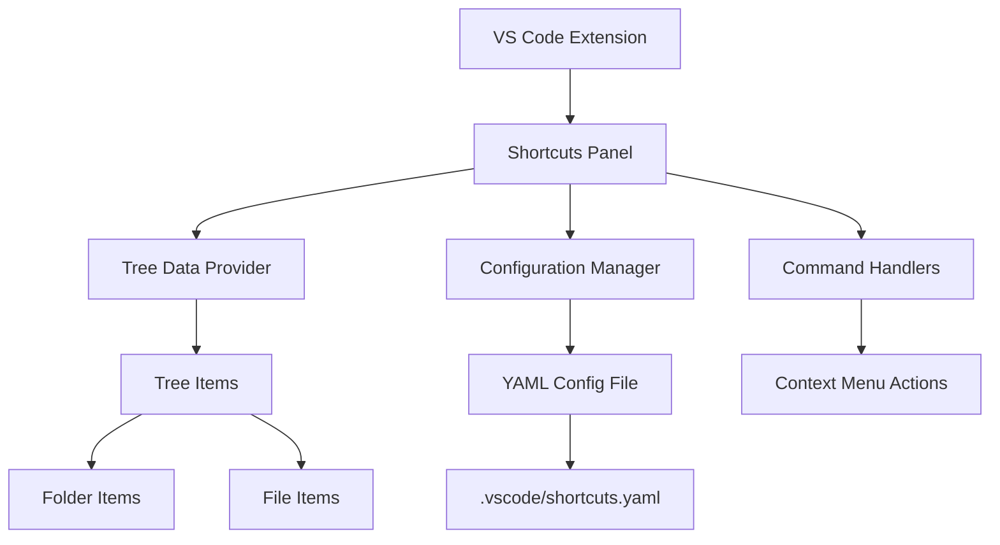

# Design Document

## Overview

The Shortcuts Panel feature extends the existing VS Code extension to provide a custom tree view in the left sidebar that displays configurable folder shortcuts. The implementation follows VS Code's extension API patterns for tree data providers and uses a YAML configuration file stored in the workspace's `.vscode` directory for persistence.

## Architecture

The feature consists of several key components working together:

1. **Tree Data Provider**: Implements `vscode.TreeDataProvider` interface to supply data to the tree view
2. **Configuration Manager**: Handles reading/writing the YAML configuration file
3. **Tree Item Models**: Represents folders and files in the tree structure
4. **Command Handlers**: Manages user interactions (add/remove shortcuts, file opening)
5. **File System Watcher**: Monitors changes to the configuration file



## Components and Interfaces

### ShortcutsTreeDataProvider

Implements `vscode.TreeDataProvider<ShortcutItem>` interface:

```typescript
class ShortcutsTreeDataProvider implements vscode.TreeDataProvider<ShortcutItem> {
    private _onDidChangeTreeData: vscode.EventEmitter<ShortcutItem | undefined | null | void>;
    readonly onDidChangeTreeData: vscode.Event<ShortcutItem | undefined | null | void>;
    
    getTreeItem(element: ShortcutItem): vscode.TreeItem;
    getChildren(element?: ShortcutItem): Thenable<ShortcutItem[]>;
    refresh(): void;
}
```

### ShortcutItem

Base class for tree items representing files and folders:

```typescript
abstract class ShortcutItem extends vscode.TreeItem {
    constructor(
        public readonly label: string,
        public readonly resourceUri: vscode.Uri,
        public readonly collapsibleState: vscode.TreeItemCollapsibleState
    );
}

class FolderShortcutItem extends ShortcutItem {
    contextValue = 'folder';
}

class FileShortcutItem extends ShortcutItem {
    contextValue = 'file';
    command: vscode.Command; // Opens file when clicked
}
```

### ConfigurationManager

Handles YAML configuration file operations:

```typescript
class ConfigurationManager {
    private configPath: string;
    
    async loadConfiguration(): Promise<ShortcutsConfig>;
    async saveConfiguration(config: ShortcutsConfig): Promise<void>;
    async addShortcut(folderPath: string, displayName?: string): Promise<void>;
    async removeShortcut(folderPath: string): Promise<void>;
    watchConfigFile(callback: () => void): vscode.FileSystemWatcher;
}
```

## Data Models

### Configuration Schema

The YAML configuration file structure:

```yaml
# .vscode/shortcuts.yaml
shortcuts:
  - path: "./src/components"
    name: "Components"
  - path: "./tests"
    name: "Tests"
  - path: "../shared-utils"
    name: "Shared Utils"
```

### TypeScript Interfaces

```typescript
interface ShortcutsConfig {
    shortcuts: ShortcutConfig[];
}

interface ShortcutConfig {
    path: string;      // Relative or absolute path to folder
    name?: string;     // Optional display name (defaults to folder name)
}
```

## Error Handling

### Configuration File Errors

1. **Missing File**: Create default empty configuration
2. **Invalid YAML**: Show error notification, use empty configuration as fallback
3. **Invalid Paths**: Skip invalid entries, show warning notification
4. **Permission Errors**: Show error notification with guidance

### File System Errors

1. **Folder Access**: Handle permission denied gracefully
2. **File Opening**: Use VS Code's built-in error handling
3. **Path Resolution**: Resolve relative paths against workspace root

### Error Recovery Strategy

```typescript
class ErrorHandler {
    static handleConfigError(error: Error): ShortcutsConfig {
        // Log error and return safe fallback
    }
    
    static showUserError(message: string, actions?: string[]): void {
        // Display user-friendly error with optional actions
    }
}
```

## Testing Strategy

### Unit Tests

1. **ConfigurationManager**: Test YAML parsing, file operations, error handling
2. **ShortcutsTreeDataProvider**: Test tree structure generation, refresh logic
3. **ShortcutItem classes**: Test tree item properties and behavior

### Integration Tests

1. **End-to-End Workflow**: Add shortcut → verify in tree → remove shortcut
2. **Configuration File Integration**: Test file watching and auto-refresh
3. **VS Code API Integration**: Test tree view registration and commands

### Test Structure

```typescript
// Test categories
describe('ConfigurationManager', () => {
    describe('loadConfiguration', () => { /* ... */ });
    describe('saveConfiguration', () => { /* ... */ });
    describe('error handling', () => { /* ... */ });
});

describe('ShortcutsTreeDataProvider', () => {
    describe('getChildren', () => { /* ... */ });
    describe('refresh', () => { /* ... */ });
});
```

## Implementation Details

### VS Code Extension Registration

The tree view is registered in the extension's `package.json` and activated in `extension.ts`:

```json
{
  "contributes": {
    "views": {
      "explorer": [
        {
          "id": "shortcutsPanel",
          "name": "Shortcuts",
          "when": "workspaceHasShortcuts || config.shortcuts.alwaysShow"
        }
      ]
    },
    "commands": [
      {
        "command": "shortcuts.addFolder",
        "title": "Add Folder Shortcut",
        "icon": "$(add)"
      },
      {
        "command": "shortcuts.removeShortcut",
        "title": "Remove Shortcut",
        "icon": "$(remove)"
      }
    ],
    "menus": {
      "view/title": [
        {
          "command": "shortcuts.addFolder",
          "when": "view == shortcutsPanel",
          "group": "navigation"
        }
      ],
      "view/item/context": [
        {
          "command": "shortcuts.removeShortcut",
          "when": "view == shortcutsPanel && viewItem == folder"
        }
      ]
    }
  }
}
```

### Performance Considerations

1. **Lazy Loading**: Only load folder contents when expanded
2. **Caching**: Cache file system queries to reduce I/O
3. **Debouncing**: Debounce configuration file changes to prevent excessive refreshes
4. **Memory Management**: Properly dispose of watchers and event listeners

### Security Considerations

1. **Path Validation**: Validate and sanitize all file paths
2. **Workspace Boundaries**: Restrict access to workspace and explicitly configured paths
3. **Configuration Validation**: Validate YAML structure and content before processing