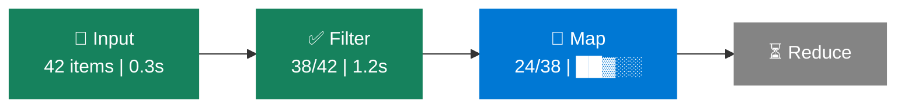

# Pipeline DAG Visualization — UX Specification

## 1. User Story

**As a** CoC dashboard user running YAML AI pipelines,
**I want to** see a visual flowchart of my pipeline's stages (input → filter → map → reduce) with live status coloring,
**So that** I can immediately understand where my pipeline is in execution, what succeeded, what failed, and how data flows between phases — without mentally reconstructing the pipeline topology from flat process lists.

### Problem Today

The `ProcessDetail` view shows a flat chronological list of conversation turns. For pipeline-type processes (`type: 'pipeline-execution'`), there is no visual indication of:
- Which phase is currently executing
- How data flows between phases
- Per-phase timing and item counts
- Where a failure occurred in the pipeline

The `PipelineResultCard` shows post-hoc stats (total items, success/fail counts) but only after completion, and without phase-level granularity.

---

## 2. Entry Points

### Primary: Automatic for Pipeline Processes

The DAG visualization appears **automatically** in the `ProcessDetail` view when the selected process has `type === 'pipeline-execution'` or `type === 'pipeline-item'` (parent pipeline). No user action is needed to enable it.

### Secondary: Expand/Collapse Toggle

A small **"▸ Pipeline Flow"** / **"▾ Pipeline Flow"** toggle header sits between the process header and the conversation turns. It defaults to **expanded** for pipeline processes, **hidden** for non-pipeline processes.

### Tertiary: Pipeline Tab in Process Detail

If a tab-based layout is later added to `ProcessDetail`, the DAG visualization would live under a **"Pipeline"** tab alongside "Conversation" and "Result" tabs. For now, it is an inline collapsible section.

---

## 3. User Flow

### 3.1 Pipeline Not Yet Started (Queued)

```
┌─────────────────────────────────────────────────┐
│  ▾ Pipeline Flow                                │
│                                                 │
│  ┌─────────┐    ┌────────┐    ┌─────┐    ┌───────┐ │
│  │  Input  │───▶│ Filter │───▶│ Map │───▶│Reduce │ │
│  │  ⏳     │    │  ⏳    │    │ ⏳  │    │  ⏳   │ │
│  └─────────┘    └────────┘    └─────┘    └───────┘ │
│                                                 │
│  Waiting to start...                            │
└─────────────────────────────────────────────────┘
```

- All nodes rendered in **grey** (`#848484`) with ⏳ icon
- Edges (arrows) are grey dashed lines
- Caption: "Waiting to start..."

### 3.2 Pipeline Running — Input Phase

```
┌─────────────────────────────────────────────────┐
│  ▾ Pipeline Flow                                │
│                                                 │
│  ┌─────────┐    ┌────────┐    ┌─────┐    ┌───────┐ │
│  │  Input  │───▶│ Filter │───▶│ Map │───▶│Reduce │ │
│  │  🔄     │    │  ⏳    │    │ ⏳  │    │  ⏳   │ │
│  │ loading │    │        │    │     │    │       │ │
│  └─────────┘    └────────┘    └─────┘    └───────┘ │
│                                                 │
│  Loading input items...                         │
└─────────────────────────────────────────────────┘
```

- **Input** node: blue pulsing border (`#0078d4`), 🔄 icon
- Downstream nodes: grey, waiting
- Active edge (Input → Filter): animated dashed blue line

### 3.3 Pipeline Running — Map Phase (Parallel Work)

```
┌──────────────────────────────────────────────────────┐
│  ▾ Pipeline Flow                                     │
│                                                      │
│  ┌─────────┐    ┌────────┐    ┌──────────┐    ┌───────┐ │
│  │  Input  │───▶│ Filter │───▶│   Map    │───▶│Reduce │ │
│  │  ✅     │    │  ✅    │    │   🔄     │    │  ⏳   │ │
│  │ 42 items│    │ 38/42  │    │ 24/38 ██▓│    │       │ │
│  └─────────┘    └────────┘    └──────────┘    └───────┘ │
│                                                      │
│  Map: 24 of 38 items processed (63%) · 2 failed      │
│  ████████████████████▒▒▒▒▒▒▒▒░░  63%                │
└──────────────────────────────────────────────────────┘
```

- **Input** & **Filter**: green (`#16825d`) with ✅, showing item counts
- **Map**: blue pulsing, with **inline progress bar** showing `completedItems/totalItems`
- **Reduce**: grey, waiting
- Below the DAG: a full-width progress bar with percentage and failure count
- If `failedMaps > 0`: progress bar includes a red segment

### 3.4 Pipeline Completed Successfully

```
┌──────────────────────────────────────────────────────┐
│  ▾ Pipeline Flow                              2m 34s │
│                                                      │
│  ┌─────────┐    ┌────────┐    ┌──────────┐    ┌───────┐ │
│  │  Input  │───▶│ Filter │───▶│   Map    │───▶│Reduce │ │
│  │  ✅     │    │  ✅    │    │   ✅     │    │  ✅   │ │
│  │ 42 items│    │ 38/42  │    │ 38/38    │    │  done │ │
│  │   0.3s  │    │  1.2s  │    │  1m 48s  │    │ 12.1s │ │
│  └─────────┘    └────────┘    └──────────┘    └───────┘ │
│                                                      │
│  ✅ Pipeline completed in 2m 34s                     │
└──────────────────────────────────────────────────────┘
```

- All nodes: green with ✅
- Each node shows: item counts + phase duration
- Edges: solid green lines
- Total duration displayed top-right of section header

### 3.5 Pipeline Failed at Map Phase

```
┌──────────────────────────────────────────────────────┐
│  ▾ Pipeline Flow                              1m 12s │
│                                                      │
│  ┌─────────┐    ┌────────┐    ┌──────────┐    ┌───────┐ │
│  │  Input  │───▶│ Filter │───▶│   Map    │   │Reduce │ │
│  │  ✅     │    │  ✅    │    │   ❌     │   │  ⛔   │ │
│  │ 42 items│    │ 38/42  │    │ 12/38    │   │skipped│ │
│  │   0.3s  │    │  1.2s  │    │ 12 fail  │   │       │ │
│  └─────────┘    └────────┘    └──────────┘    └───────┘ │
│                                                      │
│  ❌ Failed at Map phase: 12 of 38 items failed       │
│  Click node for error details                        │
└──────────────────────────────────────────────────────┘
```

- Failed node: red border + red fill (`#f14c4c`) with ❌
- Downstream nodes: dark grey with ⛔ "skipped" label
- Edge from failed node onward: red dashed line (broken chain)
- Caption with error summary and hint to click for details

### 3.6 Single-Job Pipeline (No Map/Reduce)

```
┌──────────────────────────────────────────────────────┐
│  ▾ Pipeline Flow                               4.2s  │
│                                                      │
│              ┌──────────────────┐                    │
│              │       Job        │                    │
│              │       ✅         │                    │
│              │      4.2s        │                    │
│              └──────────────────┘                    │
│                                                      │
│  ✅ Job completed in 4.2s                            │
└──────────────────────────────────────────────────────┘
```

- Single centered node for `job:` mode pipelines
- Same status coloring rules apply

### 3.7 Pipeline Without Filter Phase

```
  ┌─────────┐    ┌─────┐    ┌───────┐
  │  Input  │───▶│ Map │───▶│Reduce │
  │  ✅     │    │ 🔄  │    │  ⏳   │
  └─────────┘    └─────┘    └───────┘
```

- Filter node is **omitted** (not shown greyed out) when the pipeline YAML has no `filter:` section
- The DAG adapts to show only the phases that exist in the pipeline config

---

## 4. Node Interactions

### 4.1 Click a Node → Expand Phase Details

Clicking any DAG node opens a **popover panel** below the DAG (not a modal) showing phase-specific details:

| Phase | Popover Content |
|-------|----------------|
| **Input** | Source type (CSV/inline/generate), item count, parameter list |
| **Filter** | Filter type (rule/ai/hybrid), rules summary, included/excluded counts, filter duration |
| **Map** | Concurrency level, batch size, model used, per-item status breakdown (mini table: item → status → duration) |
| **Reduce** | Reduce type (ai/list/table/json/csv), model used, output preview (first 200 chars) |
| **Job** | Model, prompt preview, duration |

The popover closes when clicking outside, clicking the same node again, or pressing Escape.

### 4.2 Click a Failed Node → Jump to Error

If a node is in error state, clicking it:
1. Opens the phase detail popover with the error message highlighted in red
2. Shows a **"View in Conversation ↓"** link that scrolls to the relevant conversation turn

### 4.3 Hover a Node → Tooltip

Quick tooltip on hover showing:
- Phase name and status
- Duration (if completed)
- Item count (if applicable)

---

## 5. Live Update Behavior

### Data Sources for Live Updates

The DAG visualization sources its state from two channels:

1. **Initial load**: `GET /api/processes/:id` → `process.metadata` contains `pipelineName`, `executionStats`, and phase-level metadata
2. **SSE stream** (`/api/processes/:id/stream`): The `status` event carries the final state. During execution, `tool-start` / `tool-complete` events with phase-tagged metadata update individual nodes

### Phase Detection Heuristic

Since the current SSE events don't carry an explicit `phase` field, the visualization infers the active phase from:

1. **`process.metadata.currentPhase`** — new field to be added to pipeline executor (preferred)
2. **`JobProgress.phase`** values emitted via onProgress: `'splitting'` (filter), `'mapping'`, `'reducing'`, `'complete'`
3. **Tool call patterns**: input-loading tool calls → map-phase AI tool calls → reduce tool calls

**Recommendation**: Add a `pipeline-phase` SSE event type emitted at each phase transition:
```json
{ "event": "pipeline-phase", "data": { "phase": "map", "stats": { "totalItems": 38, "completedItems": 0 } } }
```

### Update Frequency

- Phase transitions: immediate (on SSE event)
- Map progress bar: updates on each `tool-complete` event (per-item granularity)
- Duration timer: ticks every 1 second while a node is in `running` state (reuse existing timer from `ProcessDetail`)

---

## 6. Visual Design

### 6.1 Rendering Technology

**Mermaid.js** (already CDN-loaded) with `flowchart LR` orientation:



**Alternative**: If Mermaid styling proves too limited for live updates (re-render flicker), use a **lightweight SVG component** rendered directly in React. The DAG is always linear (max 4 nodes), so a custom SVG is simpler than a full graph library.

**Recommendation**: Start with a **custom React SVG component** for these reasons:
- Mermaid re-renders the entire diagram on any change (causes flicker during live updates)
- The DAG is always a linear chain (no branching), so full graph layout is unnecessary
- Custom SVG allows CSS transitions for smooth status changes and progress bar animation
- The existing `useMermaid` hook is designed for static content rendering, not live-updating diagrams

### 6.2 Node Status Colors

Reuse the existing `Badge` color palette from the dashboard:

| State | Fill (Light) | Fill (Dark) | Border | Icon |
|-------|-------------|------------|--------|------|
| Waiting | `#f3f3f3` | `#252526` | `#848484` | ⏳ |
| Running | `#e8f3ff` | `#1a3a5c` | `#0078d4` | 🔄 (pulse) |
| Completed | `#e6f4ea` | `#1a3a2a` | `#16825d` | ✅ |
| Failed | `#fde8e8` | `#3a1a1a` | `#f14c4c` | ❌ |
| Skipped | `#f3f3f3` | `#1e1e1e` | `#545454` | ⛔ |

### 6.3 Edge Styles

| State | Style |
|-------|-------|
| Not reached | Grey dashed (`#848484`, `stroke-dasharray: 4`) |
| Active (data flowing) | Blue animated dash (`#0078d4`, CSS animation) |
| Completed | Solid green (`#16825d`) |
| Error path | Red dashed (`#f14c4c`, `stroke-dasharray: 8 4`) |

### 6.4 Progress Bar (Map Phase)

Inline within the Map node, a micro progress bar:
- **Background**: `#e0e0e0` (light) / `#3c3c3c` (dark)
- **Filled segment**: `#0078d4` (success) + `#f14c4c` (failed portion)
- **Height**: 4px, rounded corners
- Animates smoothly on each item completion

### 6.5 Layout & Sizing

- **Container**: full width of the detail panel, `max-height: 200px`, with the collapsible wrapper
- **Nodes**: `120px × 70px` rectangles with 8px border-radius
- **Spacing**: `60px` horizontal gap between nodes, edges centered vertically
- **Font**: `11px` for node labels, `10px` for sub-labels (counts, duration)
- **Responsive**: On narrow panels (< 500px), stack nodes vertically (`flowchart TB`)

### 6.6 Dark Mode

The component reads the existing theme class (`.dark` on `<html>`) and switches all colors accordingly. The color pairs are defined in §6.2. No additional theme toggle is needed.

---

## 7. Edge Cases & Error Handling

| Scenario | Behavior |
|----------|----------|
| **Non-pipeline process selected** | DAG section is completely hidden (no toggle visible) |
| **Pipeline metadata missing** | Show a minimal fallback: single "Pipeline" node with process status coloring. Caption: "Pipeline phase details unavailable." |
| **Filter phase not in YAML** | Omit filter node; draw Input → Map → Reduce |
| **Single-job pipeline** | Show single "Job" node centered |
| **SSE disconnects mid-run** | Freeze DAG at last known state. Show ⚠️ "Live updates paused — reconnecting..." below DAG. Recover state on reconnect via `conversation-snapshot` replay |
| **All map items fail** | Map node turns red; Reduce node shows ⛔ "skipped" |
| **Partial map failure** | Map node stays blue/green (based on threshold); annotation shows "3 failed" in orange text below the node |
| **Input phase fails** | Input node turns red; all downstream nodes show ⛔ "skipped" |
| **Process cancelled mid-run** | Active node turns orange (`#e8912d`) with 🚫; downstream nodes show ⛔ "skipped" |
| **Very fast pipeline (< 1s)** | Show completed state directly; skip animation |
| **DAG workflow (newer engine)** | Future: render actual DAG graph with branching. Out of scope for V1; fallback to linear visualization of execution tiers |

---

## 8. Settings & Configuration

No new user-facing settings. The visualization is automatic for pipeline processes.

**Internal configuration** (for development):

| Setting | Default | Description |
|---------|---------|-------------|
| `dagVisualization.enabled` | `true` | Feature flag to disable the DAG section |
| `dagVisualization.defaultExpanded` | `true` | Whether the section starts expanded |
| `dagVisualization.progressUpdateThrottle` | `250ms` | Throttle interval for progress bar updates during map phase |

These would live in the SPA client config, not exposed to end users.

---

## 9. Discoverability

- **Automatic**: No user action needed. Pipeline processes show the DAG by default.
- **Visual prominence**: The DAG section sits above the conversation turns — the most prominent position — ensuring users see it first.
- **Progressive disclosure**: Summary stats are visible in the DAG nodes; detailed per-item breakdowns are one click away in the popover.
- **Consistent language**: Uses the same "Input / Filter / Map / Reduce" terminology as the pipeline YAML, documentation, and error messages.

---

## 10. Data Requirements (API Changes)

To fully power live updates, the following additions are needed:

### 10.1 New SSE Event: `pipeline-phase`

```typescript
// Emitted by pipeline executor at each phase transition
interface PipelinePhaseEvent {
    phase: 'input' | 'filter' | 'map' | 'reduce' | 'job';
    status: 'started' | 'completed' | 'failed';
    stats?: {
        totalItems?: number;
        completedItems?: number;
        failedItems?: number;
        includedItems?: number;   // filter phase
        excludedItems?: number;   // filter phase
        durationMs?: number;
    };
}
```

### 10.2 New SSE Event: `pipeline-progress`

```typescript
// Emitted during map phase per-item completion
interface PipelineProgressEvent {
    phase: 'map';
    completedItems: number;
    failedItems: number;
    totalItems: number;
    percentage: number;
}
```

### 10.3 Process Metadata Extensions

```typescript
// Added to process.metadata for pipeline-execution processes
interface PipelineProcessMetadata {
    pipelineName: string;           // existing
    executionStats: ExecutionStats;  // existing
    // New fields:
    pipelinePhases: string[];       // e.g., ['input', 'filter', 'map', 'reduce']
    phaseTimings: Record<string, { startMs: number; endMs?: number; durationMs?: number }>;
    inputItemCount?: number;
    filterStats?: { included: number; excluded: number };
    pipelineYamlPath?: string;      // for "View YAML" link
}
```

---

## 11. Component Architecture

```
ProcessDetail.tsx
├── PipelineDAGSection.tsx          (new — collapsible wrapper)
│   ├── PipelineDAGChart.tsx        (new — SVG DAG rendering)
│   │   ├── DAGNode.tsx             (new — individual phase node)
│   │   ├── DAGEdge.tsx             (new — arrow between nodes)
│   │   └── DAGProgressBar.tsx      (new — inline map progress)
│   └── PipelinePhasePopover.tsx    (new — click-to-expand detail)
├── PipelineResultCard.tsx          (existing — stats + result)
└── ConversationTurnBubble.tsx      (existing — chat turns)
```

---

## 12. Implementation Phases

### Phase 1 — Static DAG (Completed Pipelines)

Render the DAG for already-completed pipeline processes using `process.metadata.executionStats`. No SSE integration. Shows final state with all nodes colored by success/failure.

### Phase 2 — Live Updates (Running Pipelines)

Add `pipeline-phase` and `pipeline-progress` SSE events. Wire the DAG component to update in real-time as phases progress.

### Phase 3 — Node Interaction

Add click-to-expand popovers with per-phase detail. Add "View in Conversation" scroll-to links.

### Phase 4 — DAG Workflow Support (Future)

Extend to support the newer DAG workflow engine with branching topologies (`fan-out`, `fan-in`, `merge` nodes). This requires a proper graph layout algorithm.
