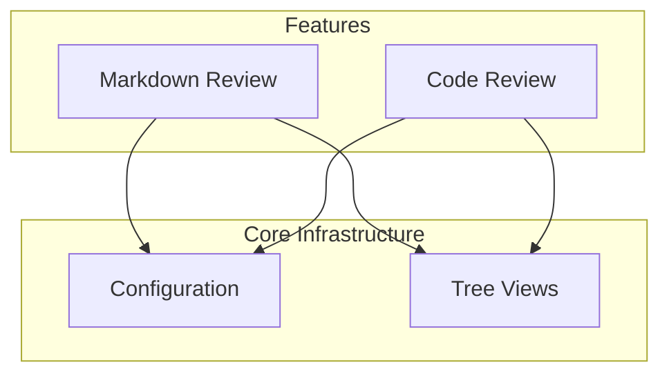
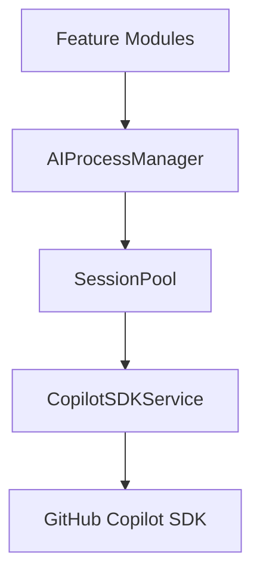

# Phase 4: Wiki Generation

## Overview

Generate markdown wiki pages from named topics, creating a navigable documentation structure with indexes, topic pages, diagrams, and source links.

---

## Goals

1. Generate well-structured markdown wiki pages
2. Create navigation indexes (features, topics, architecture)
3. Embed Mermaid diagrams for visualization
4. Include source file links with line numbers
5. Support scoped wiki generation for subfolders
6. Enable incremental regeneration

---

## Wiki Structure

### Full Repository Wiki

```
docs/wiki/
├── index.md                          # Main entry point
├── features/                         # Feature-level topics
│   ├── index.md                      # Feature index
│   ├── markdown-review.md
│   ├── git-diff-review.md
│   ├── code-review.md
│   └── yaml-pipelines.md
├── topics/                           # Cross-cutting topics
│   ├── index.md                      # Topic index
│   ├── tree-view-infrastructure.md
│   ├── ai-integration.md
│   ├── configuration-system.md
│   └── comment-system.md
├── architecture/                     # System-wide views
│   ├── overview.md                   # High-level architecture
│   ├── dependency-graph.md           # Full dependency graph
│   └── data-flow.md                  # Data flow documentation
├── external/                         # External dependencies (if scoped)
│   └── index.md                      # External deps reference
└── diagrams/                         # Generated diagrams
    ├── full-dependency-graph.mermaid
    ├── feature-interactions.mermaid
    └── [topic]-architecture.mermaid
```

### Scoped Wiki (Subfolder)

When generating for a subfolder:

```
docs/wiki/ai-service/                 # Named after target folder
├── index.md                          # Scoped overview
├── topics/
│   ├── index.md
│   ├── session-management.md
│   ├── copilot-integration.md
│   └── process-tracking.md
├── external-deps.md                  # Dependencies outside scope
└── diagrams/
    └── ai-service-architecture.mermaid
```

---

## Page Templates

### Main Index Page

```markdown
# [Project Name] Documentation

> Auto-generated by DeepWiki on [timestamp]

## Overview

[AI-generated 2-3 paragraph overview of the project]

## Quick Navigation

### Features
- [Feature 1](features/feature-1.md) - Brief description
- [Feature 2](features/feature-2.md) - Brief description

### Core Topics
- [Topic 1](topics/topic-1.md) - Brief description
- [Topic 2](topics/topic-2.md) - Brief description

### Architecture
- [System Overview](architecture/overview.md)
- [Dependency Graph](architecture/dependency-graph.md)

## Statistics

| Metric | Value |
|--------|-------|
| Total Files | X |
| Total Topics | Y |
| Test Coverage | Z% |
| Last Updated | [date] |

---
*Generated by DeepWiki*
```

### Topic Page

```markdown
# [Topic Name]

> [Category] · [File Count] files · Last modified: [date]

## Summary

[AI-generated 2-3 sentence summary]

## Purpose

[AI-generated explanation of why this exists and what problem it solves]

## Architecture

[AI-generated architecture description]

```mermaid
[Generated diagram]
```

## Key Components

| Component | File | Description |
|-----------|------|-------------|
| [Name] | [path:line](link) | [Description] |

## Dependencies

This topic depends on:
- [Topic A](../topics/topic-a.md) - [reason]
- [External: lodash](link) - [reason]

## Dependents

These topics depend on this:
- [Topic B](../topics/topic-b.md) - [reason]

## Code Examples

### [Example Title]

```typescript
// [file:line-range]
[code snippet]
```

[Explanation of the code]

## Related

- **Tests**: [test-file.test.ts](link)
- **Docs**: [related-doc.md](link)

---
*Part of [Project Name] Wiki · Generated by DeepWiki*
```

### Feature Index Page

```markdown
# Features

## Overview

This project provides the following user-facing features:

## Feature List

### [Feature 1 Name]

[Brief description]

**Key Files:**
- [file1.ts](link)
- [file2.ts](link)

[Read more →](feature-1.md)

---

### [Feature 2 Name]
...
```

### External Dependencies Page (Scoped)

```markdown
# External Dependencies

This documentation covers `[targetPath]`. The following dependencies are outside the scope:

## In-Repository Dependencies

| Module | Used By | Description |
|--------|---------|-------------|
| [shared/](../link) | session-pool.ts, types.ts | Shared utilities |

## External Packages

| Package | Used By | Purpose |
|---------|---------|---------|
| @github/copilot-sdk | copilot-sdk-service.ts | AI integration |

## Navigation

- [Back to Index](index.md)
- [Full Repository Wiki](../index.md)
```

---

## Link Generation

### Source File Links

| Link Type | Format | Example |
|-----------|--------|---------|
| File only | `[name](path)` | [utils.ts](src/utils.ts) |
| File with line | `[name](path#Lnn)` | [utils.ts:45](src/utils.ts#L45) |
| File with range | `[name](path#Lnn-Lmm)` | [utils.ts:45-60](src/utils.ts#L45-L60) |

### Cross-Reference Links

| Link Type | Format |
|-----------|--------|
| Topic to topic | `[Topic Name](../topics/topic-name.md)` |
| Feature to topic | `[Topic](../topics/topic.md)` |
| To diagram | `[Diagram](../diagrams/diagram.mermaid)` |

### GitHub Integration

When repo URL is configured:
- Source links use GitHub URLs: `https://github.com/owner/repo/blob/main/src/file.ts#L45`
- Commit links: `https://github.com/owner/repo/commit/abc123`

---

## Diagram Generation

### Dependency Graph

Full project dependency graph:
- Nodes = Topics (not individual files)
- Edges = Dependencies between topics
- Color by category
- Size by file count or importance

### Topic Architecture Diagram

Per-topic internal structure:
- Key classes/functions as nodes
- Internal dependencies as edges
- External dependencies as external nodes

### Feature Interaction Diagram

How features interact:
- Features as nodes
- Shared topics as intermediate nodes
- Data flow between features

### Mermaid Format

All diagrams use Mermaid.js syntax for compatibility:



---

## Incremental Generation

### Change Detection

| Change Type | Action |
|-------------|--------|
| File added to cluster | Regenerate topic page |
| File removed from cluster | Regenerate topic page |
| File modified | Update "last modified" only |
| Cluster renamed | Regenerate page with new name |
| New cluster | Generate new topic page |
| Cluster deleted | Remove topic page |

### Manifest File

Track generation state:

```json
{
  "version": "1.0",
  "generatedAt": "2026-01-25T10:00:00Z",
  "topics": {
    "topic_ai_service": {
      "hash": "abc123",
      "generatedAt": "2026-01-25T10:00:00Z",
      "files": ["session-pool.ts", "types.ts"]
    }
  },
  "scope": {
    "targetPath": null,
    "additionalIncludes": []
  }
}
```

### Incremental Workflow

1. Load previous manifest
2. Compare current clusters to manifest
3. Identify changed topics
4. Regenerate only changed pages
5. Update index pages
6. Save new manifest

---

## Required Changes

### New Modules

| Module | Purpose |
|--------|---------|
| `generator/index.ts` | Main generation orchestration |
| `generator/wiki-generator.ts` | Page generation logic |
| `generator/template-engine.ts` | Markdown template processing |
| `generator/diagram-generator.ts` | Mermaid diagram generation |
| `generator/link-generator.ts` | Source and cross-ref links |
| `generator/manifest-manager.ts` | Incremental generation state |
| `generator/file-writer.ts` | Write output files |

### Templates

| Template | Purpose |
|----------|---------|
| `index.hbs` | Main index page |
| `feature-index.hbs` | Feature listing |
| `topic-index.hbs` | Topic listing |
| `topic-page.hbs` | Individual topic |
| `external-deps.hbs` | External dependencies |
| `architecture.hbs` | Architecture overview |

### Configuration

| Setting | Description | Default |
|---------|-------------|---------|
| `outputPath` | Wiki output directory | `docs/wiki` |
| `templatePath` | Custom template directory | Built-in |
| `githubUrl` | Repository URL for links | Auto-detect |
| `diagramStyle` | Mermaid theme | `default` |
| `includeTimestamps` | Show generation timestamps | `true` |
| `generateDiagrams` | Create Mermaid diagrams | `true` |

---

## Testing Strategy

### Unit Tests

| Test | Description |
|------|-------------|
| Template rendering | Templates produce valid markdown |
| Link generation | Source links correct format |
| Diagram generation | Mermaid syntax valid |
| Manifest operations | Save/load/diff works correctly |

### Integration Tests

| Test | Description |
|------|-------------|
| Generate full wiki | Create wiki for this extension |
| Generate scoped wiki | Create wiki for ai-service/ only |
| Incremental regeneration | Change one topic, verify partial regen |
| Link validation | All links point to existing files |

### Quality Tests

| Test | Description |
|------|-------------|
| Markdown validity | All pages are valid markdown |
| Mermaid validity | All diagrams render correctly |
| Link reachability | No broken internal links |
| Image references | No broken image links |
| Template completeness | All sections filled |

### Output Validation

| Check | Method |
|-------|--------|
| Markdown syntax | Lint with markdownlint |
| Mermaid syntax | Render with mermaid-cli |
| Link validity | Crawl all internal links |
| File existence | Verify source file links |

### Snapshot Tests

For deterministic output:
- Snapshot test for index page structure
- Snapshot test for topic page structure
- Compare generated wiki against known-good baseline

---

## Output Examples

### Generated Topic Page (Excerpt)

```markdown
# AI Service Integration

> External Integration · 23 files · Last modified: 2026-01-20

## Summary

The AI Service Integration provides AI capabilities through GitHub Copilot SDK,
enabling features like code review, discovery, and AI-assisted clarification.

## Purpose

This module abstracts the complexity of interacting with AI services, providing
a consistent interface for other features to leverage AI capabilities. It handles
session management, request pooling, and response processing.

## Architecture

The AI service uses a three-layer architecture:



## Key Components

| Component | File | Description |
|-----------|------|-------------|
| CopilotSDKService | [copilot-sdk-service.ts:45](src/shortcuts/ai-service/copilot-sdk-service.ts#L45) | Main SDK wrapper |
| SessionPool | [session-pool.ts:23](src/shortcuts/ai-service/session-pool.ts#L23) | Connection pooling |
| AIProcessManager | [ai-process-manager.ts:12](src/shortcuts/ai-service/ai-process-manager.ts#L12) | Process lifecycle |

...
```

---

## Scope Handling

### Scoped Output Structure

When `targetPath` is specified:

1. **Output directory**: Named after target folder
2. **Index page**: Overview of scoped area only
3. **External deps page**: Lists dependencies outside scope
4. **Navigation links**: Include "Back to full wiki" if exists

### External Dependencies Page

Generated when scope excludes dependencies:
- Group by in-repo vs external packages
- Show which files use each dependency
- Link to full wiki pages if available

### Navigation Between Scopes

- Scoped wiki links to full wiki when available
- Full wiki links to scoped wikis for deep dives
- Consistent navigation header/footer

---

## Performance Considerations

| Operation | Optimization |
|-----------|-------------|
| Template rendering | Precompile templates |
| Diagram generation | Generate in parallel |
| File writing | Batch writes |
| Link validation | Cache file existence checks |

### Performance Targets

| Operation | Target |
|-----------|--------|
| Generate one page | < 100ms |
| Generate full wiki (50 pages) | < 10 seconds |
| Generate diagrams (20) | < 5 seconds |
| Incremental update (5 pages) | < 2 seconds |

---

## Success Criteria

| Criterion | Measurement |
|-----------|-------------|
| Markdown validity | 100% of pages pass linting |
| Diagram validity | 100% of diagrams render |
| Link accuracy | 0 broken internal links |
| Navigation | All pages reachable from index |
| Readability | Pages follow template structure |
| Performance | Full generation < 15 seconds |
