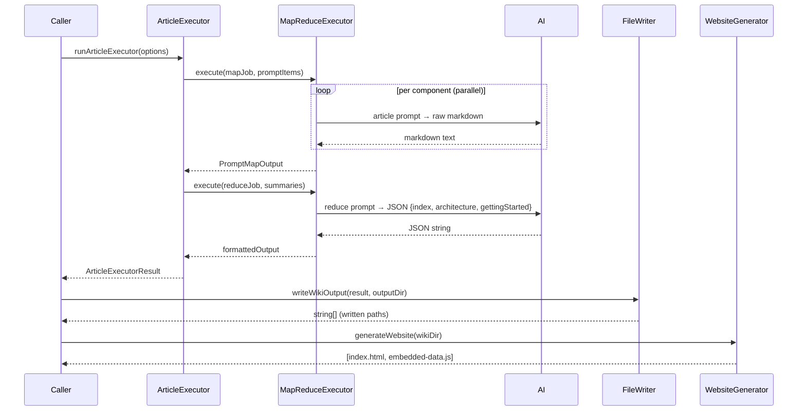

# Writing

The Writing component implements **Phase 4 (Article Generation)** and **Phase 5 (Website Generation)** of the deep-wiki pipeline. It transforms per-component `ComponentAnalysis` results from Phase 3 into polished, cross-linked markdown wiki articles using an AI map-reduce framework, then optionally builds a self-contained static HTML website for browsing.

## Table of Contents

- [Purpose & Scope](#purpose--scope)
- [Architecture](#architecture)
  - [Flat vs. Hierarchical Execution](#flat-vs-hierarchical-execution)
  - [Design Patterns](#design-patterns)
- [Public API Reference](#public-api-reference)
- [Data Flow](#data-flow)
- [Article Depth Variants](#article-depth-variants)
- [Prompt Templates](#prompt-templates)
  - [Map Prompts (Per-Component)](#map-prompts-per-component)
  - [Reduce Prompts (Index Pages)](#reduce-prompts-index-pages)
- [File Writer](#file-writer)
  - [Output Directory Layout](#output-directory-layout)
- [Website Generator](#website-generator)
- [Static Fallbacks](#static-fallbacks)
- [Usage Examples](#usage-examples)
- [Dependencies](#dependencies)
- [Related Components](#related-components)
- [Sources](#sources)

---

## Purpose & Scope

The Writing component is the **final content-generation stage** of deep-wiki. Its responsibilities are:

1. **Article map phase** — For each `ComponentAnalysis`, invoke the AI to write a standalone markdown article. The depth (`shallow` / `normal` / `deep`) controls article length and required sections.
2. **Reduce phase** — Synthesize component-level summaries into three overview pages: `index.md`, `architecture.md`, and `getting-started.md`.
3. **Hierarchical support** — Large repositories with domain groupings (produced by the large-repo discovery handler) trigger a 3-tier pipeline: component map → per-domain reduce → project-level reduce.
4. **File writing** — Write all articles to a structured directory on disk.
5. **Website generation** (Phase 5) — Embed articles and graph data into a self-contained `index.html` browsable without a web server.

---

## Architecture

```mermaid
flowchart TD
    A[ComponentAnalysis[]] -->|analysisToPromptItem| B[PromptItem[]]
    B -->|MapReduceExecutor map phase| C[GeneratedArticle[] - components]
    C --> D{graph.domains?}
    D -->|No domains - flat| E[buildReducePromptTemplate]
    D -->|Has domains - hierarchical| F[Per-domain reduce loop]
    E -->|AI reduce| G[index + architecture + getting-started]
    F -->|buildDomainReducePromptTemplate| H[domain-index + domain-architecture per domain]
    H -->|buildHierarchicalReducePromptTemplate| I[project index + architecture + getting-started]
    G --> J[WikiOutput]
    I --> J
    J -->|writeWikiOutput| K[Markdown files on disk]
    K -->|generateWebsite| L[index.html + embedded-data.js]
```

### Flat vs. Hierarchical Execution

| Mode | When | Stages |
|------|------|--------|
| **Flat** | `graph.domains` is empty | 1. Component map → 2. Single AI reduce |
| **Hierarchical** | `graph.domains` has entries | 1. Component map → 2. Per-domain reduce → 3. Project-level reduce |

`runArticleExecutor` inspects `graph.domains` and delegates to `runFlatArticleExecutor` or `runHierarchicalArticleExecutor` automatically.

### Design Patterns

- **Map-Reduce** — Article generation is a pure map (one AI call per component). The reduce pass uses compact component summaries (not full articles) to stay within model token limits.
- **Text-mode AI output** — Article map uses `outputFormat: 'list'` with no output fields, so the AI returns raw markdown (captured in `rawText`/`rawResponse`).
- **AI-mode reduce** — Index generation uses `outputFormat: 'ai'` with structured JSON output fields (`index`, `architecture`, `gettingStarted`).
- **Static fallbacks** — All AI reduce phases catch errors and call `generateStaticIndexPages` / `generateStaticDomainPages` to ensure output is always produced.
- **Incremental callbacks** — `onItemComplete` is threaded through to the executor for per-article cache writes during long runs.

---

## Public API Reference

### `generateArticles` (main entry point)

```typescript
export async function generateArticles(
    options: WritingOptions,
    aiInvoker: AIInvoker,
    onProgress?: (progress: JobProgress) => void,
    isCancelled?: () => boolean,
    onItemComplete?: ItemCompleteCallback,
): Promise<WikiOutput>
```

Runs the full map-reduce pipeline and returns `WikiOutput` containing all articles and metadata.

### `runArticleExecutor`

```typescript
export async function runArticleExecutor(
    options: ArticleExecutorOptions
): Promise<ArticleExecutorResult>
```

Lower-level entry point that dispatches to flat or hierarchical execution based on `graph.domains`.

### `analysisToPromptItem`

```typescript
export function analysisToPromptItem(
    analysis: ComponentAnalysis,
    graph: ComponentGraph
): PromptItem
```

Converts a `ComponentAnalysis` into a `PromptItem` for template substitution. Embeds the full analysis JSON and a simplified component graph for cross-linking.

### `writeWikiOutput`

```typescript
export function writeWikiOutput(output: WikiOutput, outputDir: string): string[]
```

Writes all articles to disk. Returns an array of written file paths. Creates `components/` and `domains/<id>/components/` subdirectories as needed.

### `generateWebsite`

```typescript
export function generateWebsite(wikiDir: string, options?: WebsiteOptions): string[]
```

Generates `index.html` and `embedded-data.js` from an existing wiki output directory. Returns paths to the two generated files.

### `slugify`

```typescript
export function slugify(input: string): string
```

Converts a string to a filesystem-safe slug (lowercase, hyphens, no leading/trailing hyphens).

### Static Fallback Helpers

| Function | Returns |
|----------|---------|
| `generateStaticIndexPages(graph, analyses)` | `[index.md, architecture.md]` |
| `generateStaticDomainPages(domain, analyses, graph)` | `[domain-index.md, domain-architecture.md]` |
| `generateStaticHierarchicalIndexPages(graph, domains, summaries)` | `[index.md, architecture.md]` |

---

## Data Flow



---

## Article Depth Variants

Three depth levels control article length and required sections:

| Depth | Target Length | Key Additions over Previous |
|-------|---------------|------------------------------|
| `shallow` | 500–800 words | Basic structure: overview, API table, one usage example |
| `normal` | 800–1 500 words | Architecture section, data flow, multiple examples |
| `deep` | 1 500–3 000 words | Error handling, performance, design patterns subsection, related components |

All depths require a **Table of Contents** and a **Sources** section listing source file paths from the analysis data.

---

## Prompt Templates

### Map Prompts (Per-Component)

`buildComponentArticlePromptTemplate(depth, domainId?)` — Returns a template string with `{{componentName}}`, `{{analysis}}`, and `{{componentGraph}}` placeholders.

`buildCrossLinkRules(domainId?)` — Generates cross-linking rules embedded in the article prompt:

- **Flat** (no `domainId`): `[Name](./components/id.md)`
- **Hierarchical** (`domainId` set): relative paths accounting for `domains/<id>/components/` location

### Reduce Prompts (Index Pages)

| Function | Generates |
|----------|-----------|
| `buildReducePromptTemplate()` | `index`, `architecture`, `gettingStarted` — flat layout |
| `buildDomainReducePromptTemplate()` | `index`, `architecture` — single domain |
| `buildHierarchicalReducePromptTemplate()` | `index`, `architecture`, `gettingStarted` — project-level over domain summaries |

All reduce prompts instruct the AI to return a JSON object so results can be parsed deterministically. Component summaries sent to the reducer are truncated to 500 characters each (`buildComponentSummaryForReduce`) to avoid token-limit issues.

---

## File Writer

`writeWikiOutput` resolves all paths via `getArticleFilePath(article, outputDir)`:

### Output Directory Layout

**Flat (no domains):**

```
wiki/
├── index.md
├── architecture.md
├── getting-started.md
└── components/
    ├── auth.md
    └── database.md
```

**Hierarchical (with domains):**

```
wiki/
├── index.md
├── architecture.md
├── getting-started.md
└── domains/
    └── core/
        ├── index.md
        ├── architecture.md
        └── components/
            ├── auth.md
            └── database.md
```

`normalizeLineEndings` converts all `\r\n` and `\r` to `\n` before writing.

---

## Website Generator

`generateWebsite` (in `website-generator.ts`) produces two files:

| File | Purpose |
|------|---------|
| `index.html` | Self-contained SPA with sidebar navigation, search, syntax highlighting (highlight.js), Mermaid diagrams, markdown rendering (marked.js) |
| `embedded-data.js` | Inlines `ComponentGraph` JSON + all markdown file contents as a JS object so the site works via `file://` without CORS issues |

Options (`WebsiteOptions`):

| Option | Description |
|--------|-------------|
| `theme` | `'auto'` (default) / `'light'` / `'dark'` |
| `title` | Override page title (defaults to `project.name`) |
| `noSearch` | Disable the search box |
| `customTemplate` | Path to a custom HTML template |

The website is implemented across four supporting modules:

- `website-data.ts` — Reads and serializes graph + markdown files
- `website-styles.ts` — Embedded CSS (responsive, dark/light themes)
- `website-client-script.ts` — Vanilla JS for navigation, search, mermaid init, copy buttons
- `website-generator.ts` — Orchestration and HTML template assembly

---

## Static Fallbacks

Every AI reduce call is wrapped in a `try/catch`. On failure the executor falls back to deterministic static pages:

- **`generateStaticIndexPages`** — Groups components by category, generates a basic TOC + a minimal architecture page from `graph.architectureNotes`.
- **`generateStaticDomainPages`** — Generates a per-domain component list + architecture placeholder.
- **`generateStaticHierarchicalIndexPages`** — Generates a project-level domain table + architecture placeholder.

This ensures the pipeline never exits without output, even under AI timeouts or quota errors.

---

## Usage Examples

### Generating Articles

```typescript
import { generateArticles } from '@plusplusoneplusplus/deep-wiki';

const output = await generateArticles(
    {
        graph: componentGraph,
        analyses: componentAnalyses,
        depth: 'normal',
        concurrency: 5,
        timeout: 1_800_000,
    },
    aiInvoker,
    (progress) => console.log(`${progress.completed}/${progress.total}`),
);

console.log(`Generated ${output.articles.length} articles in ${output.duration}ms`);
```

### Writing to Disk

```typescript
import { writeWikiOutput } from '@plusplusoneplusplus/deep-wiki';

const paths = writeWikiOutput(output, './wiki-output');
console.log(`Wrote ${paths.length} files`);
```

### Generating the Website

```typescript
import { generateWebsite } from '@plusplusoneplusplus/deep-wiki';

const [htmlPath, dataPath] = generateWebsite('./wiki-output', {
    theme: 'auto',
    title: 'My Project Wiki',
});
console.log(`Website at ${htmlPath}`);
```

### Lower-Level Article Execution

```typescript
import { runArticleExecutor, writeWikiOutput } from '@plusplusoneplusplus/deep-wiki';

const result = await runArticleExecutor({
    aiInvoker,
    graph,
    analyses,
    depth: 'deep',
    concurrency: 3,
    timeoutMs: 3_600_000,
    onProgress: (p) => console.log(p),
    onItemComplete: async (item, result) => {
        await articleCache.saveArticle(item.componentId, result.rawText);
    },
});
```

---

## Dependencies

### Internal

| Module | Usage |
|--------|-------|
| `@plusplusoneplusplus/pipeline-core` | `createPromptMapJob`, `createPromptMapInput`, `createExecutor`, `AIInvoker`, `JobProgress`, `ItemCompleteCallback` |
| `../types` | `ComponentGraph`, `ComponentAnalysis`, `GeneratedArticle`, `WikiOutput`, `WritingOptions`, `DomainInfo`, `WebsiteOptions` |
| `../schemas` | `normalizeComponentId` — converts component IDs to URL-safe slugs |

### External

| Package | Usage |
|---------|-------|
| `fs` (Node built-in) | File I/O in `file-writer.ts` and `website-generator.ts` |
| `path` (Node built-in) | Cross-platform path construction |

### CDN (website only, loaded at runtime)

| Library | Version | Purpose |
|---------|---------|---------|
| `highlight.js` | 11.9.0 | Syntax highlighting |
| `mermaid` | 10 | Diagram rendering |
| `marked` | latest | Markdown → HTML |

---

## Related Components

- [Map-Reduce AI Framework](./map-reduce-ai-framework.md) — The `MapReduceExecutor` and `createPromptMapJob` / `createExecutor` APIs used as the execution backbone of article generation.
- [Codebase Discovery Engine](./codebase-discovery-engine.md) — Phase 1; produces the `ComponentGraph` consumed here.
- [Incremental Cache Invalidation](./incremental-cache-invalidation.md) — The `onItemComplete` callback hooks directly into the article cache for incremental saves during long-running generation.

---

## Sources

- `packages/deep-wiki/src/writing/index.ts`
- `packages/deep-wiki/src/writing/article-executor.ts`
- `packages/deep-wiki/src/writing/file-writer.ts`
- `packages/deep-wiki/src/writing/prompts.ts`
- `packages/deep-wiki/src/writing/reduce-prompts.ts`
- `packages/deep-wiki/src/writing/website-generator.ts`
- `packages/deep-wiki/src/writing/website-data.ts`
- `packages/deep-wiki/src/writing/website-styles.ts`
- `packages/deep-wiki/src/writing/website-client-script.ts`
