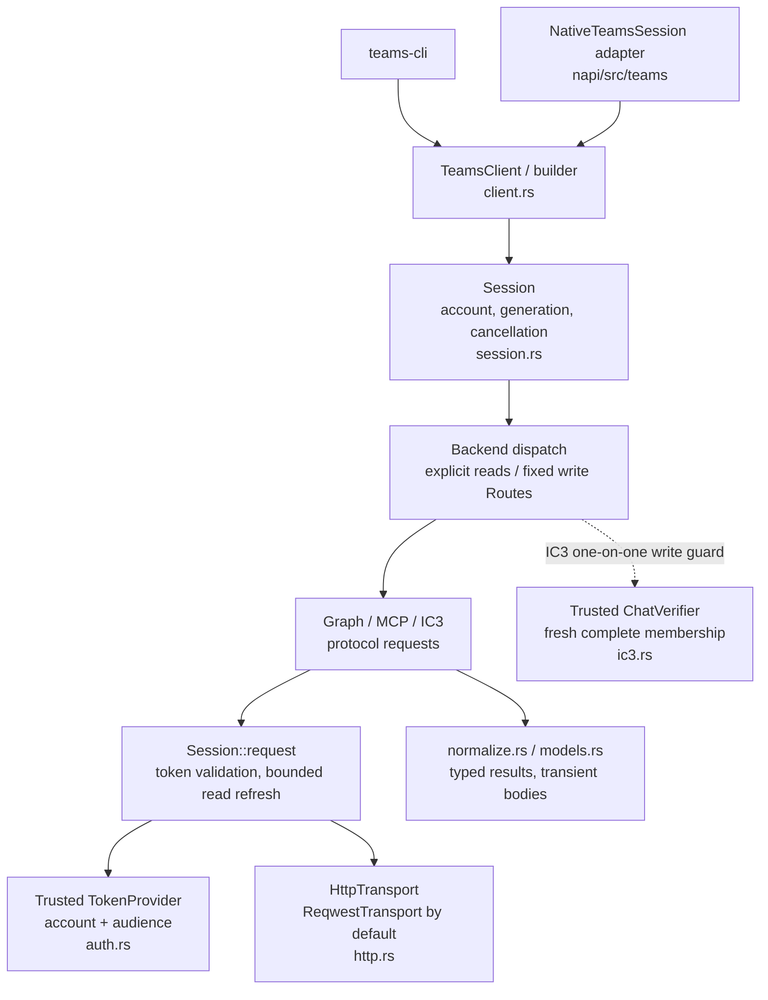
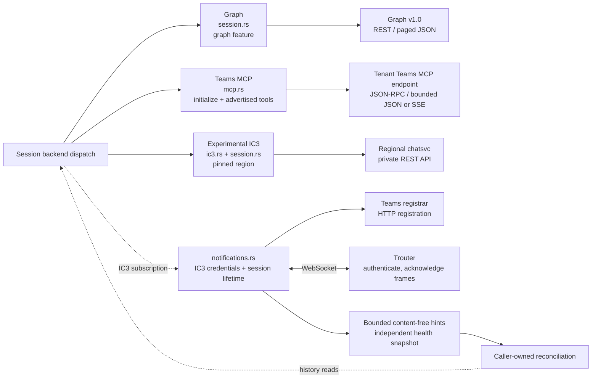

# teams-sdk

Unpublished Rust library crate (edition 2021, MIT) in the native Cargo workspace;
shares `../Cargo.lock`, `../target/` and native CI.
No npm package, N-API binding, Node dependency, CoC policy, persistence or classification.

- `client.rs` builds clients with trusted token/HTTP providers; `session.rs` pins accounts,
  routes, references and opaque cursors to a shared revocable lifetime.
- `constants.rs` centralizes provider endpoints, chat ID markers and Trouter client
  configuration, with independent OAuth endpoint-value assertions in its unit tests.
  Auth resource tests use those constants and verify tenant-path escaping.
  The CLI owns its environment-variable names and help in its own `src/constants.rs`;
  JSON field names and protocol test fixtures stay inline.
- `models.rs` separates body-free metadata from transient, untrusted display content.
  Transient bodies/tokens have no Debug/Serialize implementation and are never logged/cached.
- The default feature is `graph`; MCP, IC3 and Trouter are always compiled.
  Default write routes use Graph.
  `graph` uses stable Graph v1.0. MCP uses the fixed tenant Teams MCP endpoint,
  initialization/tool advertisement and bounded JSON/SSE responses. IC3 provides
  region-pinned private chatsvc APIs and independent Trouter change hints.
- Graph reads request `include-unknown-enum-members`; only known system events or exact
  senderless HTML system sentinels are skipped. MCP reply pages use `replies` envelopes.
  MCP initialization publishes session state only after initialization and all tool pages
  complete; cancellation or dropped futures leave the shared state uninitialized.
- No implicit backend fallback, URL overrides, write replay or cross-region retry.
  Read HTTP 401 refreshes at most once, pinned to the same account; 403 never refreshes.
  Credential metadata comes from the trusted provider, not unverified JWT parsing.
- IC3 ordinary writes require `send_to_existing_one_on_one`, an intended recipient and
  a fresh complete `ChatVerifier` membership result. Generic IC3 chat sends reject.
  IC3 chat participants read bounded thread rosters; channel participants/history/replies
  are unsupported. MCP channel detail uses
  bounded message/reply paging; missing targets fail explicitly.
- Notifications are bounded hints, never message authority or durable delta. Startup,
  reconnect, loss and overflow require caller reconciliation. Drop/close revokes ingress.
  IC3 notifications connect to `wss://go.trouter.teams.microsoft.com/v4/c/`.
  Self-chat events produce `Changed` hints for `48:notes`; other `48:` activity streams
  require source-thread evidence or produce gap hints.
  Network/protocol reconnects reuse valid credentials; authentication failures and
  token-lease expiry request refresh from the trusted credential provider.
- Tests inject trusted Rust transports. Production HTTP rejects redirects, caps bodies,
  never retries transport errors and sanitizes errors without provider payloads.

## Architecture

### Client and session boundaries

The CLI and native adapter consume the same Rust API; their authentication and application
policy stay outside this crate. A client shares immutable configuration, while each session
owns its account binding, generation, cancellation lifetime and MCP protocol state.



Read backends come from explicit arguments or session-bound references. Write backends come
from `Routes`; unsupported operations fail without fallback. Close/reconnect revokes the
session and its clones. Trusted transport injection is a test boundary, not a URL override.

### Backend protocols and notifications

Graph is feature-gated and enabled by default. MCP and experimental IC3 always compile;
IC3 requires an explicit region. All backend HTTP requests use the shared session request
and transport boundary. IC3 notifications use a separate WebSocket connection and HTTP
registration, not the chat-history stream.



SSE in MCP carries RPC responses, not a change subscription. Trouter hints require
reconciliation on startup, reconnect, loss or overflow; history/detail reads remain the
source of message content. The capability table below defines each backend's supported
operations and write restrictions.

## Public API and backend support

`TeamsClient::builder` accepts a trusted `TokenProvider`, fixed write `Routes`, an optional
trusted `HttpTransport`, and optional IC3 region/verifier. `session(account)` creates an
independent lifetime; `reconnect` revokes the old session and all its clones. References
created with `conversation`/`message_ref` establish session ownership, not membership.

| Capability | Graph | MCP | Experimental IC3 |
|---|---|---|---|
| Chat discovery (`chats`) | Paged | Bounded `ListChats(fetchAllPages)` | Paged supported chat types |
| Teams/channels discovery | `teams`/`channels` | `teams_with_backend`/`channels_with_backend` | Unsupported |
| Chat history/detail | Supported | Supported | Supported after exact chat/type verification |
| Channel root/reply history | Separate typed collections | Separate typed collections | Unsupported |
| Channel detail | Direct lookup | Bounded history scan | Unsupported |
| Chat/channel participants | Actual member pages | Advertised membership tools; channel-root refs | Chat thread roster; channels unsupported |
| Self send | Unsupported | Advertised self-send tool | Explicit `48:notes` |
| Ordinary chat send | Existing chat; no mentions | Advertised send tool | Only `send_to_existing_one_on_one` with intended recipient and fresh complete verification |
| Channel send/reply | Supported | Advertised tools | Unsupported |
| Channel Like | Native `setReaction` | Unsupported | Explicit exact-ID emotions route |
| Notifications | Unsupported | Unsupported | Independent Trouter hint subscription |

`history` returns transient text/untrusted HTML/mention evidence; `messages` immediately
projects body-free metadata. `detail` returns a single transient message. Message reads
retain edits and tombstones. `scan_messages` deduplicates by modification time and prefers
deletion on ties, returning `Scan::Incomplete` on failure/caps rather than partial coverage.
Ordinary pages are not complete-scan guarantees. Cursors are opaque and session/backend/
collection scoped. Text is UTF-8 bounded; oversized HTML is omitted rather than sliced.
IC3 participants validate the exact chat/type before reading the region-pinned
`threads/{id}?view=msnp24Equivalent` roster. Roster reads accept at most 200 entries,
reject explicit continuation markers and supplied cursors, and require unique
`8:orgid:` identities. Other identity types fail explicitly. Returned entries retain
hidden/historical members and do not establish current or complete membership for
write authorization; the trusted `ChatVerifier` contract remains separate.
Cursor paths compare individually decoded segments, allowing equivalent ID escaping while
rejecting encoded separators, malformed/nested escapes and raw or encoded dot traversal.

MCP tools must be advertised; absent tools fail explicitly. MCP list tools without paging
parameters reject incomplete results. The SDK has no OAuth login implementation, profile/
chat-title APIs, chat creation, attachment/card APIs, edit/delete writes, durable delta,
incremental timestamp filtering, or command admission. Chat replies/Likes are unsupported.
IC3 groups, channels, mentions and replies are unsupported write targets. Public-cloud
provider origins are fixed; sovereign-cloud endpoints and arbitrary server URLs are not
configurable. Tests use synthetic credentials and trusted injected transports, not live
Microsoft services.

## Teams CLI

`../teams-cli/` is an independent Cargo binary project using this library. Its `teams-cli`
command is read-only: `list` prints chat IDs/types;
`view <chat-id>` prints escaped message text and sender names. Both read one page and
report whether more pages exist. `watch --seconds <1-3600>` verifies IC3 notification
registration and prints status, escaped chat/message IDs and reconciliation hints,
without message bodies. It defaults to 60 seconds, rejects Graph, closes the subscription
on completion and fails if registration does not complete or is inactive at the deadline.
Hints require history reads
for reconciliation and are not a complete message stream.
Clap defines subcommands, typed identifiers and global
options, accepting options before or after subcommands and `--option=value` syntax.
Help/version exit successfully without authentication; invalid arguments exit with code
2, and runtime failures exit with code 1. Supply `TEAMS_TENANT_ID`, `TEAMS_USER_ID`,
`TEAMS_GRAPH_TOKEN` and `TEAMS_GRAPH_TOKEN_EXPIRES_AT` (Unix seconds) from a trusted
OAuth authority with delegated Graph `Chat.Read` permission. Credentials stay pinned;
the CLI does not authenticate, verify token claims or refresh. Output contains
transient message content and must not enter shared logs.
`--tenant-id <tenant-id>` before or after the command overrides `TEAMS_TENANT_ID`;
when both are absent, the tenant defaults to `az account show --query tenantId -o tsv`.
Invalid explicit settings and failed discovery fail without fallback.
When `TEAMS_USER_ID` is absent, the CLI checks `az account show --query tenantId -o tsv`
against the selected tenant, then reads `az ad signed-in-user show --query id -o tsv`.
Explicit user IDs bypass identity discovery when the token is also explicit.
Without `TEAMS_GRAPH_TOKEN`, the CLI verifies Azure CLI's tenant and signed-in user,
then loads `az account get-access-token --tenant <tenant-id> --resource https://graph.microsoft.com -o json`.
It validates the returned tenant, Bearer type and UTC `expires_on` through the same expiry
checks as explicit credentials. CLI diagnostics and token payloads are not printed.
An explicit token requires `TEAMS_GRAPH_TOKEN_EXPIRES_AT`; invalid explicit values fail
without fallback. Azure CLI must be signed in as a user; Graph chat permissions/consent
are still required and an Azure CLI token may lack them.
`--backend graph|ic3` defaults to IC3. IC3 defaults to region `amer`;
`--region amer|emea|apac` overrides it. IC3 is always available;
Graph rejects region arguments. Both commands
use the selected backend without fallback. IC3 uses `TEAMS_IC3_TOKEN` with
`TEAMS_IC3_TOKEN_EXPIRES_AT`, or the same Azure CLI credential flow for resource
`https://ic3.teams.office.com`. Tokens remain audience/account pinned.
IC3 is a private experimental API; Azure CLI resource authorization may be unavailable.
Use `--backend graph` for Graph reads. These defaults apply only to the CLI;
library feature selection and write routes retain their own defaults.
Run from the native Rust workspace with `cargo run --locked -p teams-cli -- --help`,
`cargo run --locked -p teams-cli -- list` or
`cargo run --locked -p teams-cli -- view <chat-id>`.
Install from that workspace with `cargo install --locked --path teams-cli`, then run
`teams-cli list`, `teams-cli view <chat-id>` or `teams-cli --version` from any directory.
The CLI shares the native lockfile, has no Node dependency, and forwards its
`graph` Cargo feature to this SDK. CI tests it on Linux, macOS
and Windows, including builds without Graph using `--no-default-features`.

## Validation

Run from the native Rust workspace (`packages/coc-native/rust/`):

```text
cargo fmt --all -- --check
cargo clippy --locked -p teams-sdk --all-targets --all-features -- -D warnings
cargo build --locked -p teams-sdk --all-features
cargo test --locked -p teams-sdk
cargo test --locked -p teams-sdk --no-default-features
cargo test --locked -p teams-sdk --all-features
cargo audit
```

CLI validation from the same workspace:

```text
cargo build --locked -p teams-cli
cargo clippy --locked -p teams-cli --all-targets --all-features -- -D warnings
cargo test --locked -p teams-cli
cargo test --locked -p teams-cli --no-default-features
cargo test --locked -p teams-cli --no-default-features --features graph
```
